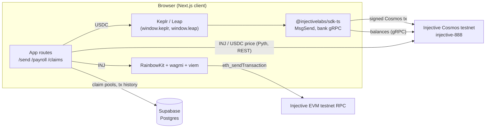

<div align="center">
  
  <h1>NinjaPay</h1>
  <p><strong>Non-custodial payments, payroll, and claim links on Injective.</strong><br/>Built for the Injective Africa community.</p>

  <p>
    <a href="https://ninjapay.xyz">Website</a> ·
    <a href="#feature-status">Feature status</a> ·
    <a href="#architecture">Architecture</a> ·
    <a href="#getting-started">Getting started</a> ·
    <a href="#known-issues">Known issues</a>
  </p>

  <p>
    
    
    
    
  </p>
</div>

> [!IMPORTANT]
> NinjaPay is a **testnet prototype**. It is not audited and must not be used with mainnet funds. The naira off-ramp and bill payments are **not live**: no payout partner is connected and NinjaPay never takes custody of funds. See [Feature status](#feature-status) and [Known issues](#known-issues) before building on it.

---

## Contents

- [Overview](#overview)
- [Feature status](#feature-status)
- [Architecture](#architecture)
- [Networks, tokens, and denominations](#networks-tokens-and-denominations)
- [Project structure](#project-structure)
- [Getting started](#getting-started)
- [Environment variables](#environment-variables)
- [Database setup (Supabase)](#database-setup-supabase)
- [How the transaction flows work](#how-the-transaction-flows-work)
- [Security model](#security-model)
- [Known issues](#known-issues)
- [Design system](#design-system)
- [Scripts](#scripts)
- [Testing](#testing)
- [Roadmap](#roadmap)
- [Contributing](#contributing)
- [Community](#community)

---

## Overview

NinjaPay is a Next.js dApp for moving value on Injective without handing over your keys. One interface covers:

- **Sending** INJ and USDC to any Injective address.
- **Payroll**: paying a list of recipients in one flow.
- **Claim links**: shareable links that split an amount across a group.
- **History and analytics** for a connected wallet.

Every transfer is built in the browser and signed by the user's own wallet (Keplr, Leap, or an EVM wallet through RainbowKit). NinjaPay does not run a backend that holds keys or funds. The only server-side state is claim-pool metadata stored in Supabase.

The longer-term goal is real-world utility for users in Nigeria: cashing out to NGN bank accounts and paying utility bills. Both are deliberately **disabled** until a licensed payout partner is integrated. The interface says so wherever they appear.

---

## Feature status

| Feature | Route | Status | What actually happens today |
|---|---|---|---|
| Send INJ | `/send` | Working on testnet | Native value transfer from the connected EVM wallet through wagmi `useSendTransaction`. The recipient can be typed as `inj1…`, `0x…` or a `.inj` name; an `inj1…` address is converted to its `0x…` form. |
| Send USDC | `/send` | Built; not yet sent on testnet | An ERC-20 `transfer` on Circle's USDC contract from the connected EVM wallet, like any token in MetaMask. The gas limit is the wallet's estimate plus 30% for Circle's compliance hook. USDC is a MultiVM token, so the bank balance moves with it; Keplr and Leap aren't needed to send. |
| Wallet setup | `/setup` | Working | Adds or switches the wallet to Injective's EVM network and adds USDC to its token list in one click each, with the values for adding them by hand. Links to the INJ and Circle USDC testnet faucets (on mainnet, Injective's page on getting INJ) and to Keplr and Leap. Linked from the landing page and from Send when the account has no INJ. |
| Receive | `/receive` | Working | Shows the wallet's account as `inj1…` and `0x…` with a QR code for each and a network warning. **Ask for a set amount** makes a link and QR that open `/send` with the address, token and amount filled in; the page reports the payment as received once the account's balance of that token on Injective has gone up by at least that amount. Person-to-person only. |
| Payroll | `/payroll` | Built; not yet sent on testnet | Rows take an address or a `.inj` name, shown with the address it points to on review. Pays everyone in one `MsgMultiSend`: one signature, one fee, all or nothing. The connected EVM wallet signs it as EIP-712 typed data, or Keplr/Leap signs it natively once connected. Up to 50 recipients per run. Every row is checked against the token's rules before signing, since one blocked recipient fails the batch. Paid runs are saved on the device and each is checked against its transaction before it shows as paid; a run can be used again or saved as CSV. An account can give another a payroll budget (an authz send approval with a cap, an end date and an optional list of accounts), and the other account can then pay runs from it. |
| Claim links: create | `/claims` | Working on testnet (INJ verified) | By default the funds stay in the creator's wallet (an EVM wallet such as MetaMask, or Keplr/Leap): the creator approves the link to send at most the total, and to pay each claim's fee, until it expires (1, 7 or 30 days), and can cancel it at any time. Or the creator funds a one-time escrow account and can reclaim leftovers. Either way the link's key lives only in its `#fragment` and the creator's browser. |
| Claim links: redeem | `/claim/[claimId]` | Working on testnet (INJ verified) | Reserves a share atomically in Supabase, then pays it to the claimer's Keplr/Leap address (or the `inj1` form of their EVM address), from the creator's wallet or from the escrow. Claimers need no INJ. |
| Transactions | `/transactions` | Working | One list, newest first, for your Keplr/Leap account and your EVM wallet: bank transfers from Injective's indexer, and INJ and ERC-20 transfers sent from EVM wallets (such as USDC from MetaMask) from Blockscout. **Load more** pages further back, and **Download CSV** saves the listed transfers as a statement made on the device. Each row links to its receipt. Claim activity is labelled by matching escrow addresses to claim pools. Other tokens are named from Injective's verified token list; a token not on it shows as a short denom marked **unverified**. |
| Beneficiaries | `/beneficiaries` | Working (this browser) | Saved to `localStorage`, deliberately not to Supabase, which has no auth yet. Accepts `inj1…`, `0x…` or a `.inj` name, stores the `inj1…` form, and spots the same account saved twice in different formats. A beneficiary saved by name keeps the name and is paid at the saved address; the list warns when the name now points somewhere else. **Send** prefills `/send` with the address. |
| Live updates | every dashboard page | Working | While the dashboard is open, balances and history update when a payment arrives, and a **Payment received** notice links to its receipt. The signals come from an ERC-20 `Transfer` log subscription on Injective's EVM WebSocket and the indexer's account portfolio stream, both opened from the browser. Amounts always come from re-reading the chain, never from the signal. INJ sent from an EVM wallet emits no `Transfer` log, so its notice depends on the portfolio stream reporting the balance change, which Injective's docs don't confirm; balances still refresh every 30 seconds either way. NinjaPay runs no server-side watcher, since that would link wallets to people (NDPA). |
| Approvals | `/approvals` | Working | Lists the authz grants (another account may act for yours) and fee allowances (another account may pay its network fees from your INJ) that each connected account has given or received, read from the chain, each in plain words with its cap and expiry. Grants with no cap over funds and grants with no expiry are flagged. Revoking is one signature (`MsgRevoke` or `MsgRevokeAllowance`) from the wallet holding the account: the EVM wallet over EIP-712, or Keplr/Leap. ERC-20 spending allowances aren't listed. |
| Receipts | `/receipt/[hash]` | Working | A shareable receipt for any transaction hash, Cosmos or EVM: amount, sender and recipient, time, block, network fee, memo and status, read from the chain each time it opens. Linked from Transactions and from Send and Payroll once a transfer settles. NinjaPay keeps no copy; the link holds only the hash. |
| Analytics | `/analytics` | Working | Totals over whole days (7, 30 or 90, back to local midnight): exact amounts sent and received per token, the same in USD at today's Injective oracle price (indicative), distinct transactions, counterparties, a daily or weekly chart and a breakdown by type. It reads older history until every source reaches the window's first day, up to 10 pages per source at a time, and says how far back the totals go when it stops short. Tokens with no current price are named and left out of USD totals. Failed transfers, moves between your own connected accounts and reclaimed claim funds aren't counted. |
| Off-ramp to NGN | `/send` (Off-Ramp tab) | Not live | Placeholder only (`components/OfframpUnavailable.tsx`). No naira rate is quoted and no bank details are collected. |
| INJ → USDC quote | `/send` (Off-Ramp tab) | Waiting on Injective's swap allowlist | Asks Injective's Swap precompile what the INJ/USDC spot market would give for an amount of INJ, with a 0.5% slippage floor, the market's taker fee rate, the swap's network fee and a check against the Pyth price. Quote only: no swap button and no naira amount. It shows a quote only once Injective adds the market to its swap allowlist, which NinjaPay can't do; until then it says so. |
| Bill payments (airtime, data, electricity, cable) | `/bills` | Not live | Form is disabled; no payment is taken and nothing is sent to a provider. |
| Wallet connection | all app routes | Working | RainbowKit (EVM wallets) for everything: Send as EVM transactions, and Payroll, claim links and revokes as Cosmos messages signed over EIP-712. Keplr/Leap is optional and signs those natively when connected. Keplr/Leap is only asked to connect when the user clicks **Connect Keplr or Leap**; later visits reconnect quietly. |

`lib/paystack.ts` and `lib/vtpass.ts` contain integration code for Paystack and VTPass, but no page imports them today.

---

## Architecture

NinjaPay talks to Injective over **two rails**. Which rail a transfer uses depends on the token, not on how the recipient's address is written: `inj1…` and `0x…` are the same account.



- **EVM rail.** RainbowKit and wagmi handle connection and signing for MetaMask and other EVM wallets. Send uses it for both INJ and USDC (an ERC-20 transfer).
- **Cosmos rail.** Cosmos SDK messages (`MsgMultiSend`, `MsgSend`, authz and fee-grant messages) built with `@injectivelabs/sdk-ts`, for Payroll, claim links and Approvals. Keplr or Leap sign them in `SIGN_MODE_DIRECT`; an EVM wallet signs them as EIP-712 typed data (`SIGN_MODE_EIP712_V2`). Balances come from the bank module over gRPC (`lib/injective/bank.ts`).
- **Data.** Supabase stores claim-pool metadata and is meant to store transaction history. INJ and USDC prices come from the Pyth prices Injective keeps on chain (`lib/prices.ts`), are shown as indicative, and are hidden once they are more than 10 minutes old. Injective has no naira price, so the app shows no naira rate; that will come only from a licensed partner's quote.
- **Rendering.** The landing page (`/`) is a Server Component and does not load the wallet stack. `Web3Providers` is mounted only in `app/(dashboard)/layout.tsx` and `app/claim/layout.tsx`.

### Stack

| Layer | Choice |
|---|---|
| Framework | Next.js 16 (App Router, Turbopack), React 19, TypeScript 5.9 |
| Styling | Tailwind CSS v4 (`@tailwindcss/postcss`) with CSS variable tokens in `app/globals.css` |
| Motion | `motion` (`motion/react`), with `prefers-reduced-motion` respected |
| Fonts | Geist and Geist Mono via `next/font` |
| EVM wallets | RainbowKit 2, wagmi 2, viem 2 |
| Cosmos / Injective | `@injectivelabs/sdk-ts`, `networks`, `ts-types`, `utils` (all pinned to 1.20.52, upgraded together) |
| Data | Supabase (`@supabase/supabase-js`), TanStack Query |
| State | React state, Zustand available |
| Icons | `lucide-react` |

---

## Networks, tokens, and denominations

All network settings live in `lib/injective/network.ts`. Set `NEXT_PUBLIC_INJECTIVE_NETWORK=mainnet` to target mainnet; anything else (including unset) means testnet.

| Setting | Testnet | Mainnet |
|---|---|---|
| Cosmos chain ID | `injective-888` | `injective-1` |
| EVM chain ID (wagmi, RainbowKit, "add network") | `1439` (`0x59f`) | `1776` (`0x6f0`) |
| EVM JSON-RPC | `https://k8s.testnet.json-rpc.injective.network/` | `https://sentry.evm-rpc.injective.network/` |
| EVM explorer (0x transaction hashes) | `https://testnet.blockscout.injective.network` | `https://blockscout.injective.network` |
| Cosmos explorer (Cosmos transaction hashes) | `https://testnet.explorer.injective.network` | `https://injscan.com` |

`explorerTxUrl` in `lib/injective/network.ts` picks the explorer from the hash itself: `0x` plus 64 hex digits goes to Blockscout (`/tx/<hash>`), anything else to InjScan (`/transaction/<hash>`). The InjScan path follows the old explorer's URLs; it could not be checked from the build environment.

The EVM chain ID and the Cosmos chain ID name the **same** network, so a `0x…` address and its `inj1…` form are one account with one balance ([Injective docs](https://docs.injective.network/developers/network-information), [converting addresses](https://docs.injective.network/developers/convert-addresses)). NinjaPay accepts either format anywhere it asks for an address, stores the `inj1…` form, and shows both on the dashboard (`lib/injective/address.ts`). Earlier builds pointed wallets at chain `2424`, which is inEVM; Injective's [EVM cheat sheet](https://docs.injective.network/developers-evm/evm-integrations-cheat-sheet) says not to use inEVM because it is deprecated.

Token settings live in `lib/injective/tokens.ts`.

| Token | Testnet | Mainnet | Decimals |
|---|---|---|---|
| INJ | `inj` | `inj` | 18 |
| USDC (Circle, native) | `erc20:0x0C382e685bbeeFE5d3d9C29e29E341fEE8E84C5d` | `erc20:0xa00C59fF5a080D2b954d0c75e46E22a0c371235a` | 6 |

USDC is Circle's native USDC on Injective ([Injective docs](https://docs.injective.network/developers-defi/usdc-stablecoin)). It follows the MultiVM Token Standard: the ERC-20 contract (the address after `erc20:`) and the bank denom are one token with one balance, so a MetaMask user's USDC shows up without Keplr. Denoms and logos come from Injective's [token lists](https://github.com/InjectiveLabs/injective-lists).

Two details to keep in mind:

- **Denom casing.** Injective's token list writes the address checksummed, and its agent-skills constants write it in lowercase. NinjaPay compares denoms case-insensitively and signs bank messages with the exact spelling the chain reports for the sender's balance.
- **Legacy USDC.** Earlier builds used the Polygon USDC.e Peggy denom `peggy0x2791…4174`. It is not Circle's native USDC and is labelled `USDC.e (legacy)` in history. Reclaiming a claim pool returns every token it holds, including that one.
- **Other tokens.** NinjaPay sends and prices only the two denoms above, matched exactly. Anything else in a wallet's history is named from the verified entries of Injective's token list, which `/api/tokens` reads on the server (the testnet list is over 20 MB). A listed token that calls itself INJ or USDC on another denom, such as Ethereum's bridged INJ (`peggy0xe28b…`), keeps its denom beside the name and is never priced as INJ. A token not on the list shows as a short denom and raw amount, marked unverified. Which assets can be cashed out to naira is for the licensed partner to decide, not this list.

**Amounts.** Cosmos amounts are integer strings in base units: `1 INJ = 10^18 inj` and `1 USDC = 10^6` base units. Convert **exactly once**, at the edge where the message is built. Most of the current payment bugs come from converting twice.

---

## Project structure

```text
app/
  layout.tsx                  Root layout: fonts, metadata (no wallet providers)
  page.tsx                    Landing page (Server Component)
  globals.css                 Design tokens (Injective palette), base layer, utilities
  (dashboard)/                Wallet-enabled app, wrapped in Web3Providers
    layout.tsx                Navigation, footer, Web3Providers
    send/ payroll/ claims/ bills/ beneficiaries/ transactions/ analytics/
    page.tsx                  Dashboard home (shares the "/" path with app/page.tsx)
  claim/
    layout.tsx                Web3Providers for public claim links
    [claimId]/page.tsx        Public claim redemption page
  receipt/[hash]/page.tsx     Shareable receipt read from the chain (no wallet needed)
  api/evm-rpc/route.ts        Optional EVM RPC proxy that keeps a provider key on the server
  api/tokens/route.ts         Injective's verified tokens, trimmed for the browser
components/
  landing/                    Client leaves for the landing page (Reveal, Steps, Faq, HeroArt)
  Navigation.tsx              App nav with RainbowKit ConnectButton
  Web3Providers.tsx           wagmi config, RainbowKit theme, QueryClient
  OfframpUnavailable.tsx      Honest "not live" off-ramp placeholder
  SwapQuote.tsx               INJ → USDC quote from the Swap precompile
  StatusChip.tsx, TxStatus.tsx   Transfer state chip and status line with explorer link
  PayrollRuns.tsx             Past payroll runs, each checked against its transaction
  PayrollBudgetForm.tsx       Give another account a payroll budget
  ChainHealthNotice.tsx       "Sending is paused" and scheduled-upgrade banners
  QrCode.tsx                  Dark-on-white QR code as one SVG path
  CopyButton.tsx              Copy-to-clipboard button
  LivePayments.tsx            Live updates and "Payment received" notices on the dashboard
hooks/
  useWallet.ts                Thin wrapper over wagmi useAccount
  useCosmosTransaction.ts     Keplr/Leap connection and sendToken
  useEvmSigner.ts             The connected EVM wallet as a signer for Cosmos messages (EIP-712)
  useBalance.ts               INJ/USDC balances from the bank module
  useChainHealth.ts           Chain id and block freshness for the rail a page sends on
  useActivity.ts              On-chain history for the connected accounts, paged and merged
  useConnectedAccounts.ts     The connected inj1 accounts, once each
  useTokenList.ts             Injective's verified tokens, by denom
  usePrices.ts                Indicative INJ and USDC prices, refreshed each minute
  useRecipients.ts            Recipient fields: address or .inj name, resolved
  useSwapQuote.ts             INJ → USDC quote, slippage floor, fee and oracle check
  useTransferChecks.ts        Pre-send checks for one transfer
  usePayrollChecks.ts         Pre-send checks for every row of a payroll run
lib/
  injective/
    network.ts                Network, chain ids, endpoints, explorers, faucets
    tokens.ts                 INJ and native USDC: denoms, decimals, contracts
    token-list.ts             Names for other denoms from Injective's verified token list
    address.ts                inj1… and 0x… as one account
    names.ts                  .inj names through the Injective Name Service
    swap.ts                   Swap precompile: INJ/USDC route, allowlist, quote maths
    transfer-checks.ts        Circuit breaker, token rules and new-address checks
    fees.ts                   INJ network fee maths and checks
    health.ts                 Chain id, block freshness and upgrade-plan checks
    transfer-errors.ts        USDC compliance-hook errors in plain words
    bank.ts                   Balance queries, MsgMultiSend builder
    cosmos-transactions.ts    Cosmos signing: Keplr/Leap direct, EVM wallets over EIP-712; sendToken
    claim-escrow.ts           Claim-link escrow: plan, fund, pay out, sweep
    claim-grant.ts            Claim links paid from the creator's wallet: approve, pay out, cancel
    payroll-budget.ts         Payroll budgets: give, read, check and pay a run from one
    payroll-reconcile.ts      Whether a saved payroll run matches its transaction
    activity.ts               Bank-transfer history from Injective's indexer, merged across sources
    evm-activity.ts           EVM wallet transfers (INJ value, ERC-20) from Blockscout
    receipt.ts                One transaction's transfers, fee and status, from REST or EVM RPC
    analytics.ts              Totals over whole-day windows: per token, USD, counts, chart
    live.ts                   Live signals: EVM Transfer-log subscription, indexer portfolio stream
    grants.ts                 Authz grants and fee allowances: read, describe, revoke
    cctp.ts                   Circle CCTP V2 contracts and burn call for a future payout partner (not wired)
    constants.ts              Re-exports network settings, env-backed config
    broadcast.ts, evm-config.ts, types.ts
  money.ts                    Exact amount <-> base-unit conversion
  prices.ts                   INJ and USDC prices from Injective's Pyth oracle
  payment-request.ts          Payment-request links to /send
  statement.ts                CSV activity statement and payroll runs, made in the browser
  payroll-runs.ts             Paid payroll runs, saved in this browser
  supabase.ts                 Claim pools and transaction history
  paystack.ts, vtpass.ts      Payout and bill integrations (not wired to any page)
public/
  favicon.png                 The app icon at 512px (social cards, README)
  brand/                      The in-app logo (ninja-mark.svg), hero mark (ninja-hero.svg) and the footer's engraved savanna (savanna.webp)
scripts/savanna.js            Draws the footer's savanna as SVG
tests/                        Unit tests (npm test)
  e2e/                        Money paths on a local Injective chain (npm run test:e2e)
.github/workflows/e2e.yml     Runs the end-to-end tests on demand
```

---

## Getting started

### Prerequisites

- **Node.js 20 or newer** (developed on Node 24) and npm.
- A **Supabase** project (the free tier is fine).
- At least one wallet:
  - [Keplr](https://www.keplr.app/) or [Leap](https://www.leapwallet.io/) for the Cosmos rail (`inj1…` addresses).
  - MetaMask or any WalletConnect wallet for the EVM rail (`0x…` addresses).
- **Testnet INJ** from the [Injective testnet faucet](https://testnet.faucet.injective.network/).

### Install and run

```bash
git clone https://github.com/ALIPHATICHYD/NINJA-PAY.git
cd NINJA-PAY
npm install
cp .env.example .env.local   # then fill in your Supabase URL and anon key
npm run dev
```

Open <http://localhost:3000>.

In development, every route is compiled the first time you open it. The first load of a wallet-enabled route can take several seconds because it compiles the Injective SDK, viem, and WalletConnect; later loads are fast. To judge real performance, run a production build:

```bash
npm run build && npm start
```

---

## Environment variables

Variables prefixed `NEXT_PUBLIC_` are **bundled into client JavaScript and visible to anyone**. Only put publishable values in them. `INJECTIVE_EVM_RPC_URL` is the one server-only variable. See [Security model](#security-model).

| Variable | Required | Used by | Notes |
|---|---|---|---|
| `NEXT_PUBLIC_SUPABASE_URL` | Yes, for claims and analytics | `lib/supabase.ts` | Supabase → Project Settings → API. |
| `NEXT_PUBLIC_SUPABASE_ANON_KEY` | Yes, for claims and analytics | `lib/supabase.ts` | Publishable anon key. Protect tables with RLS. |
| `NEXT_PUBLIC_INJECTIVE_NETWORK` | No | `lib/injective/network.ts` | `mainnet` to target mainnet. Defaults to testnet. |
| `NEXT_PUBLIC_INJECTIVE_GRPC` / `NEXT_PUBLIC_INJECTIVE_REST` / `NEXT_PUBLIC_INJECTIVE_INDEXER` / `NEXT_PUBLIC_INJECTIVE_EXPLORER` | No | `lib/injective/network.ts` | Chain gRPC-web, LCD, indexer and indexer explorer URLs from a premium provider. Default to Injective's shared public endpoints, which its [docs](https://docs.injective.network/infra/public-endpoints) don't recommend for production traffic. |
| `NEXT_PUBLIC_INJECTIVE_EVM_WS` | No | `lib/injective/live.ts` | EVM WebSocket (`wss://`) for live payment updates. Used in the browser, so it must be keyless. Defaults to Injective's public WebSocket endpoint from the [EVM network information](https://docs.injective.network/developers-evm/network-information) page. |
| `NEXT_PUBLIC_INJECTIVE_EVM_RPC` | No | `components/Web3Providers.tsx`, `lib/injective/health.ts` | EVM JSON-RPC for reads. A keyless provider URL, or `/api/evm-rpc` to use the server proxy below. The public RPC stays as a fallback. |
| `INJECTIVE_EVM_RPC_URL` | No (server-only) | `app/api/evm-rpc/route.ts` | A premium EVM RPC URL with its API key. The proxy forwards only read methods and `eth_sendRawTransaction`, falls back to the public RPC, and logs nothing. Anyone who can reach the route can use it, so add rate limiting before relying on it. |
| `NEXT_PUBLIC_WALLETCONNECT_ID` | Required for any deployment | `components/Web3Providers.tsx` | NinjaPay's own project id from [WalletConnect Cloud](https://cloud.walletconnect.com), with the site's domains on its allowlist. Mobile and QR-code wallets connect through it. A shared fallback id is hardcoded only so local development works. |
| `NEXT_PUBLIC_BACKEND_URL` | No | `lib/injective/constants.ts` | Defaults to `http://localhost:3001`. No backend ships with this repo. |
| `NEXT_PUBLIC_PAYSTACK_KEY` | No | `lib/paystack.ts` | Not used by any page. Use a **public** key only (`pk_test_…`). |
| `NEXT_PUBLIC_VTPASS_USERNAME` / `NEXT_PUBLIC_VTPASS_PASSWORD` | No | `lib/vtpass.ts` | Not used by any page. These are credentials and **must not ship to the browser**; move them server-side before enabling bills. |

Example `.env.local`:

```env
NEXT_PUBLIC_SUPABASE_URL=https://your-project.supabase.co
NEXT_PUBLIC_SUPABASE_ANON_KEY=your-anon-key
NEXT_PUBLIC_WALLETCONNECT_ID=your-walletconnect-project-id
```

`ENV_SETUP_GUIDE.md` has step-by-step instructions for obtaining each key.

---

## Database setup (Supabase)

Run the following in the Supabase SQL editor. The columns match what `lib/supabase.ts` reads and writes.

```sql
create extension if not exists "uuid-ossp";

create table if not exists claim_pools (
  id              uuid primary key default uuid_generate_v4(),
  creator_address text        not null,
  name            text        not null,
  total_amount    text        not null,          -- human-readable amount, not base units
  claim_type      text        not null,          -- split type: equal | percentage | custom
  shares          jsonb       not null default '[]'::jsonb,  -- [{ "address": "", "amount": "1.5" }]
  claimed_by      jsonb       not null default '[]'::jsonb,  -- ["inj1…", …]
  link_code       text        not null unique,
  created_at      timestamptz not null default now()
);

create index if not exists claim_pools_creator_idx on claim_pools (creator_address);

create table if not exists transactions (
  id           uuid primary key default uuid_generate_v4(),
  user_address text        not null,
  type         text        not null check (type in ('send', 'bills', 'claim', 'payroll')),
  status       text        not null check (status in ('pending', 'confirmed', 'failed')),
  amount       text        not null,
  recipient    text,
  tx_hash      text,
  created_at   timestamptz not null default now()
);

create index if not exists transactions_user_created_idx
  on transactions (user_address, created_at desc);

-- Claim-link escrow. Only the escrow's public address is stored; its key never reaches the server.
alter table claim_pools add column if not exists token          text check (token in ('INJ', 'USDC'));
alter table claim_pools add column if not exists escrow_address text;

-- One row per claimed share. The unique constraints are the lock that stops
-- a share being paid twice or one address claiming twice.
create table if not exists claims (
  id              uuid primary key default uuid_generate_v4(),
  pool_id         uuid        not null references claim_pools (id) on delete cascade,
  share_index     int         not null,
  claimer_address text        not null,
  status          text        not null default 'pending' check (status in ('pending', 'paid')),
  tx_hash         text,
  created_at      timestamptz not null default now(),
  constraint claims_one_per_share   unique (pool_id, share_index),
  constraint claims_one_per_claimer unique (pool_id, claimer_address)
);
```

If you created the tables from an earlier version of this README, run the `alter table` and `create table claims` statements above as a migration. Older databases may also be missing `transactions.user_address`, which makes `create index ... transactions_user_created_idx` fail with `column "user_address" does not exist`. Add it first with `alter table transactions add column if not exists user_address text;`. The claims code looks for the constraint names `claims_one_per_share` and `claims_one_per_claimer`, so keep them as written.

### Row Level Security

The app talks to Supabase from the browser with the anon key, so **enable RLS on both tables**. The app has no wallet-signature auth yet, which means the database cannot verify who is making a request. Until auth exists, treat these tables as untrusted, public data:

```sql
alter table claim_pools  enable row level security;
alter table transactions enable row level security;
alter table claims       enable row level security;

-- Prototype policies: anyone may read and insert. Tighten before any real use.
create policy "read claim pools"   on claim_pools  for select using (true);
create policy "create claim pools" on claim_pools  for insert with check (true);
create policy "read claims"        on claims       for select using (true);
create policy "reserve claims"     on claims       for insert with check (true);
create policy "mark claims paid"   on claims       for update using (true);
create policy "release claims"     on claims       for delete using (status = 'pending');
create policy "read transactions"  on transactions for select using (true);
create policy "insert transactions" on transactions for insert with check (true);
```

These policies let any client insert or update claim rows. The funds themselves are protected by the link's key and the chain's limits on it, not by the database: a forged `claims` row cannot move tokens. What a hostile client *can* do is reserve shares it never pays out, or mark rows paid. That is acceptable on testnet. For production, move reservation behind a server route that checks a signature from the claimer, or move claim state on-chain (see [Roadmap](#roadmap)). No `update` policy on `claim_pools` is needed any more.

---

## How the transaction flows work

### Send (`/send`)

1. The user chooses INJ or USDC and enters a recipient. It can be written as `inj1…` or `0x…`. `parseAccountAddress` in `lib/injective/address.ts` checks it (bech32 checksum for `inj1…`, EIP-55 checksum for mixed-case `0x…`), shows the other form under the field, and blocks sending to your own wallet. A payment-request link from **Receive** (`/send?to=…&token=…&amount=…`) fills in all three and reminds the payer to check the address with the person who sent it.
   It can also be a `.inj` name. `lib/injective/names.ts` asks the Injective Name Service's registry contract for the name's resolver and the resolver for its address, and the page shows the full address under the field; that address is what gets paid. Names must be at least 3 lowercase letters, digits or hyphens, which keeps out lookalike Unicode names. A typed address shows its primary `.inj` name only if that name resolves back to the same address, as the INS docs advise.
   Before **Send** is enabled, `lib/injective/transfer-checks.ts` asks the chain three things. Has Injective's circuit breaker switched off this kind of transaction? (Injective's chain at v1.20.3 doesn't include the circuit module, so for now this finds nothing; see [Known issues](#known-issues).) Do the token's permission rules pause sending or receiving, or leave either account without the role for it? Has the recipient ever been used? The first two block the send and explain why in plain words, as the chain's or the issuer's rule; NinjaPay doesn't screen transfers and never suggests a way around a restriction. An unused recipient is a warning only.
   The amount is converted to exact base units as it is typed. The page shows the network fee in INJ (fees are always paid in INJ, even for USDC; `lib/injective/fees.ts`) and disables **Send** when the sending account can't cover the amount plus the fee. **Max** leaves room for the fee when sending INJ.
2. **INJ:** the page calls wagmi `sendTransaction({ to, value })` with the recipient's `0x…` form and the exact base units. The connected EVM wallet signs, and `useWaitForTransactionReceipt` tracks confirmation.
   Injective's EVM charges the whole gas limit at the transaction's fee cap (`maxFeePerGas`) and refunds no unused gas. So both INJ and USDC transfers ask the wallet for the price the page quoted, with no priority fee, and USDC transfers also for the quoted gas limit. The fee charged is then the fee shown. Left to itself, a wallet sets the cap above the price (viem uses 1.2x) and the user pays the difference.
3. **USDC:** the page calls wagmi `writeContract` for an ERC-20 `transfer(to, amount)` on Circle's USDC contract, from the same wallet and with the same receipt tracking. USDC is a MultiVM token, so the transfer moves the bank balance Keplr and Leap show too. Every USDC transfer runs Circle's compliance hook, so the gas limit is the wallet's estimate plus 30%. Estimating already runs the hook, so a restricted transfer is reported as the issuer's rule before the wallet opens.

Payroll, claim links and revokes are Cosmos transactions. The connected EVM wallet signs them, or Keplr or Leap once connected. `sendToken` in `lib/injective/cosmos-transactions.ts` converts the **human-readable** amount to base units once with `toChainAmount`, which is string-based and rejects too many decimal places. It builds a `MsgSend` and hands it to `signAndBroadcast`, which:
   1. fetches the account number, sequence, and latest block height from the chain's REST API;
   2. builds the transaction with `createTransaction` and a timeout height;
   3. simulates it to size the gas limit (with a 1.3x buffer, and a fixed fallback if simulation can't be reached). If simulation shows the chain would refuse the messages, for example a payment larger than the balance, it stops before the wallet opens: signed and broadcast, the transaction would fail the same way and still be charged its fee;
   4. checks that the account holds enough INJ for that fee plus any INJ being sent, and stops with a plain message before the wallet opens if it doesn't;
   5. asks Keplr or Leap to sign in `SIGN_MODE_DIRECT`, or the EVM wallet to sign the transaction as EIP-712 typed data (`eth_signTypedData_v4`, switching the wallet to Injective's EVM network first if needed). The typed data is Injective's v2 layout: the messages and the fee, account, sequence and timeout as two JSON strings, which injective-core renders the same way to check the signature. An EVM wallet doesn't report its public key, so the key is recovered from the signature, checked against the connected account, and sent with the account's first Cosmos transaction;
   6. broadcasts it and waits until the transaction is included in a block.

### Payroll (`/payroll`)

The payroll screen has three steps: name the run, add recipients (`inj1…`, `0x…` or a `.inj` name; a row that repeats an account already listed is flagged), then review and dispatch. Dispatch sends one `MsgMultiSend`, built by `buildPayrollMultiSend` in `lib/injective/bank.ts`: one input carrying the total and one output per recipient. That is one signature and one fee, and the bank module applies it atomically: either every recipient is paid or none is. A run pays up to 50 recipients, NinjaPay's own cap. Because one blocked recipient fails the whole batch, the review step first checks the circuit breaker for `MsgMultiSend`, the token's permission rules for the sender and every row, and flags rows that have never been used (`hooks/usePayrollChecks.ts`). The batch is simulated for gas before the wallet opens. The employer's own wallet signs; NinjaPay never holds payroll funds.

**Past runs.** A run that confirms is saved in this browser only (`lib/payroll-runs.ts`), like beneficiaries: the database has no auth yet, and who was paid how much is personal data under Nigeria's NDPA. A saved run is a claim about the chain, not a record of payment. Each one is shown as **Paid on chain** only when its transaction pays every row, exactly, from the account the run says, and nothing else (`lib/injective/payroll-reconcile.ts`). Otherwise it shows as failed, not found, pending, or not matching, with the rows that differ. **Use again** fills a new run from it, and **CSV** saves it with the result of that check.

**Payroll budgets.** The account that holds the payroll funds (the owner) can let another account (an operator, such as a payroll officer) pay payroll from it: **Let someone else run payroll** signs one authz `SendAuthorization` with a total, an end date of 7, 30 or 90 days, and optionally only the accounts of a saved run (`lib/injective/payroll-budget.ts`). The operator then sees **Pay from** with the budget, and a run goes out as one `MsgExec` carrying one `MsgSend` per row from the owner's account. The operator signs and pays the fee; the owner's account pays the total. The chain takes each payment off the budget and refuses the whole transaction if any one goes over what's left, pays an account not on the list, or comes after the end date, so either everyone is paid or nobody is. The page checks all three before the wallet opens. The owner sees the budget on Approvals and can revoke it there at any time. NinjaPay holds nothing and can't use a budget. Giving one again to the same account replaces the old one.

A treasury that needs several people to approve each run (M-of-N) isn't built: it needs Cosmos's group module, and Injective's chain at v1.20.3 doesn't enable it (its queries answer `Not Implemented`).

### Claim links (`/claims` → `/claim/[claimId]`)

A claim link carries a **one-time key in its `#fragment`**. There are two kinds. By default the funds stay in the creator's wallet and the key may only spend what the creator approved for it (`lib/injective/claim-grant.ts`). The other kind moves the funds to a one-time escrow account that the key controls (`lib/injective/claim-escrow.ts`).

**Funds stay in the creator's wallet**

1. The creator enters a name, token, total, number of recipients and how long the link works (1, 7 or 30 days). The browser makes the link's key and checks that the wallet holds the total and the claim fees.
2. The creator signs one transaction with two approvals for the key, both ending when the link expires. An authz `SendAuthorization` lets it send at most the total of that token from the creator's account. A fee allowance lets it spend up to 0.000096 INJ per share of the creator's INJ on network fees. The allowance also creates the key's account on chain, which is what lets it sign while holding nothing.
3. The link is `https://…/claim/<code>#k=<key>&kind=grant`.
4. A claim is a `MsgExec` carrying a `MsgSend` from the creator to the claimer, signed by the key with the creator as fee granter. Before signing, the page reads what the approval still allows and the creator's balances, and stops with a plain message if the link has ended or the wallet no longer holds enough, so nothing is charged. The chain itself refuses anything over the total or after the expiry.
5. **Cancel Link** in `/claims` revokes both approvals. It needs only the creator's wallet, not the link, so it works from any browser. The approvals also appear on `/approvals` under the link's name.

Nothing leaves the creator's wallet until someone claims. The trade-off is that a claim fails if the creator has spent the funds in the meantime; the escrow kind avoids that.

**Escrow: creating a pool**

1. The creator enters a name, token, total, and number of recipients. The total is split equally in base units with `BigInt`. Any indivisible remainder goes to the first shares, one base unit each, so the shares always sum to exactly the total.
2. The browser generates a fresh escrow key from 32 bytes of `crypto.getRandomValues`, and saves it to `localStorage` **before** any funds move, so the creator can always reclaim.
3. The creator signs one `MsgSend` to the escrow address. It carries the total, plus an INJ reserve for fees: enough for 600,000 gas (0.000096 INJ) for each share plus one final sweep. For USDC pools, the message carries two coins, sorted by denom as the chain requires.
4. The pool is saved to Supabase with the escrow's **address**, token, and share amounts. The key is never sent to the server.
5. The link is `https://…/claim/<code>#k=<escrow key>`. Browsers never send the `#fragment` to a server.

**Escrow: claiming**

1. The page reads the key from the fragment and checks that it derives the pool's `escrow_address`.
2. The claimer connects Keplr or Leap, or an EVM wallet (its `0x` address is converted to the matching `inj1` address).
3. The page reserves the next free share by inserting a `claims` row. The unique constraints on `(pool_id, share_index)` and `(pool_id, claimer_address)` make that insert the lock.
4. The escrow key signs a `MsgSend` of that share to the claimer. Gas is sized by simulation (1.3x, capped at 600,000, which the fee reserve covers). If USDC's compliance hook runs out of gas, the payout is retried once with twice the gas. The row is then marked `paid` with the transaction hash. If the payout fails, the reservation is deleted so someone else can claim that share.

**Escrow: reclaiming.** In `/claims`, the creator's browser can sweep everything left in the escrow (unclaimed shares plus unused fee reserve) back to the funding address. After a sweep, remaining claimers will see that the pool is out of funds.

**Trust model.** NinjaPay never holds the key or the funds. The link is a **bearer secret**: anyone who has it can claim, and a malicious holder could take everything the key can reach directly: the escrow's balance, or, for a link paid from the creator's wallet, up to the approved total before it expires or is cancelled. Share links privately. "One claim per address" is enforced by the database, not the chain, and it stops honest double-claims, not a determined attacker with many addresses. An escrow contract could enforce one claim per address on chain, but a contract NinjaPay deploys that holds users' funds raises a custody question for counsel first (see [Roadmap](#roadmap)).

Pools created before this design have no escrow and are shown as *unfunded*. They cannot be claimed.

## Security model

- **Non-custodial by construction.** Private keys stay in the user's wallet. NinjaPay builds unsigned messages or transactions, and the wallet signs them.
- **Never put secrets in `NEXT_PUBLIC_*` variables.** Anything with that prefix is readable in the browser bundle. Paystack **secret** keys, VTPass credentials, and any escrow private key must live in server-only code (route handlers or server actions) and non-public environment variables.
- **Supabase is public infrastructure here.** The anon key is shipped to clients, so RLS is the only guard. See [Row Level Security](#row-level-security).
- **Testnet only.** `constants.ts` hardcodes `Network.Testnet`. Moving to mainnet must be a deliberate change, reviewed alongside the fixes below.
- **No audit.** Nothing in this repository has been security-reviewed or audited.

To report a vulnerability, open a private security advisory on the GitHub repository rather than a public issue.

---

## Known issues

These are verified against the current code. They are the priority list before any real-value use.

| # | Severity | Issue | Where |
|---|---|---|---|
| 1 | Medium | A claim reservation left `pending` (for example, the tab closed after reserving but before the payout confirmed) keeps that share locked. Nothing expires stale reservations yet. If the payout did land on-chain, the row simply never flips to `paid`. | `lib/supabase.ts` |
| 2 | Medium | Claim links are bearer secrets and one-claim-per-address is database-enforced, not on-chain. See the trust model under [Claim links](#claim-links-claims--claimclaimid). | `lib/injective/claim-escrow.ts` |
| 3 | Medium | VTPass credentials are read from `NEXT_PUBLIC_*` variables and would be exposed in the browser if enabled. | `lib/vtpass.ts` |
| 4 | Low | The link's key, for re-copying the link and reclaiming an escrow, is kept in the creator's `localStorage`. Clearing site data, or switching browsers, loses it there; the full link is the backup. A link paid from the creator's wallet can still be cancelled without it. | `lib/injective/claim-escrow.ts` |
| 5 | Low | `app/page.tsx` and `app/(dashboard)/page.tsx` both resolve to `/`. Next.js builds, but only one page is reachable. | `app/` |
| 6 | Low | `amount` columns and share amounts are stored as human-readable strings. Floating-point math on them (`parseFloat`, `/ count`) can produce rounding drift. Use `bignumber.js`, which is already a dependency. | `app/(dashboard)/claims/page.tsx` |
| 7 | Low | Ledger accounts in Keplr/Leap are rejected with a clear error that suggests connecting the Ledger through an EVM wallet instead. A Ledger in MetaMask is asked for the same EIP-712 signature as any MetaMask account, but this hasn't been tried with a real Ledger, and Injective's Ledger guide signs the older EIP-712 layout (`SIGN_MODE_LEGACY_AMINO_JSON`), so a Ledger may need that instead. | `lib/injective/cosmos-transactions.ts` |
| 8 | Low | The circuit-breaker check never finds anything. Injective's docs describe the circuit module, but the chain at v1.20.3 doesn't include it and answers the query with `501 Not Implemented`, which the check treats as no finding. The end-to-end tests fail if a later chain version starts serving it. | `lib/injective/transfer-checks.ts` |
| 9 | Low | A payroll paid from a budget shows on its receipt and under Past runs, but Transactions and Analytics may not list it. History comes from Injective's indexer, and how the indexer reports payments inside an authz `MsgExec` hasn't been checked, since a local chain has no indexer. | `lib/injective/activity.ts` |
| 10 | Low | Past runs are kept in this browser's `localStorage`. Another browser, or cleared site data, shows none; the payments themselves are on chain. | `lib/payroll-runs.ts` |

**Fixed:**

- MetaMask and other EVM wallets can sign Payroll, claim links (create and cancel) and revokes on Approvals. They sign the Cosmos transaction as EIP-712 typed data, which Injective checks against the transaction itself, so Keplr or Leap is no longer needed for anything. Before, those screens asked every user to install Keplr or Leap. A signature from a different account than the one connected is refused before it is sent.
- A transaction that simulation showed the chain would refuse, such as a payroll run larger than the balance, was still sent to the wallet with a fallback gas limit. Once signed it failed on chain and was charged its fee. Wallet signing and claim payouts now stop before signing and say why. Found by the end-to-end tests.
- EVM receipts showed `gasUsed × effectiveGasPrice` as the fee, but Injective charges the gas limit at the fee cap and refunds nothing, so a receipt could show less than was paid (20% less for a viem transfer). Receipts now show the fee charged, and Send asks the wallet for the price it quoted. Found by the end-to-end tests; the rule is in injective-core's `MsgEthereumTx.GetFee`, and `RefundGas` is disabled.
- Transactions lists transfers sent from EVM wallets. INJ and USDC sent from MetaMask used to be missing, because history only searched the chain's bank messages. History now comes from Injective's indexer and Blockscout, a page at a time with **Load more**, instead of two slow searches capped at 100 transactions each.
- The Injective SDK packages moved together from 1.14.41 to 1.20.52, the release with Injective's EVM chain ids and the import paths the docs use. Transactions built and signed by both versions are byte-identical. Signing keeps a 120-block window, because 1.20 halved the default. The unused `@injectivelabs/wallet-ts` package is gone, and `npm audit` findings fell from 208 to 49.
- History names tokens from Injective's verified token list, so an `ibc/` or `peggy` denom shows its name instead of a hash. INJ and USDC are recognised and priced by exact denom only; before, USD totals priced a coin by its label. The hardcoded testnet USDT entry is gone.
- Payroll goes out as one `MsgMultiSend`, as the page always said, instead of one transaction per recipient. Each row is checked against the token's rules first.
- Send transfers USDC from the connected EVM wallet as an ERC-20 transfer, like INJ. Before, USDC went through Keplr or Leap even for MetaMask users, sometimes from a different account than the connected wallet.
- Send, Payroll and Beneficiaries take `.inj` names from the Injective Name Service, show the address a name points to, and show a typed address's primary name when it resolves back to that address. A beneficiary saved by name warns when the name has since been pointed at a different address.
- Send checks the circuit breaker and the token's permission rules before the wallet opens, instead of failing with a raw chain error afterwards, and warns when the recipient address has never been used on Injective.
- Prices come from Injective instead of CoinGecko: the Pyth INJ/USD and USDC/USD prices the chain keeps in its oracle module, read by feed id. A price more than 10 minutes old is shown as unavailable, and USD totals are hidden rather than counting an unpriced token as $0 or USDC as exactly $1. The hardcoded ₦1,600 "parallel market" rate and every naira conversion helper are gone; no naira rate is shown until a licensed partner quotes one.
- Chain endpoints are configurable (`NEXT_PUBLIC_INJECTIVE_*`), with an optional server proxy that keeps a premium EVM RPC key off the client. Send, Payroll, Claims and the claim page check that the endpoint reports the expected chain id and a block from the last minute before allowing a send, re-checking every 30 seconds, and they warn when governance has scheduled a chain upgrade (`lib/injective/health.ts`).
- Transaction links go to the explorer that matches the hash (Blockscout for EVM, InjScan for Cosmos) on every page, and Send shows one status line per transfer: waiting for signature, pending, confirmed, or failed. A reverted INJ transfer used to show nothing, because wagmi's receipt wait throws on a revert; it now shows **Failed**.
- USDC transfers run Circle's compliance hook on Injective. When the hook runs out of gas (`types.ErrorOutOfGas`), which Injective's docs say is not a real restriction, wallet transactions and claim payouts now retry once with twice the gas. A real restriction is reported as the token issuer's rule, and NinjaPay says it doesn't screen transfers. Claim payouts and refunds size gas by simulation instead of a fixed 200,000. Keplr/Leap no longer opens an approval window on page load, and the unused `NEXT_PUBLIC_ESCROW_WALLET` setting is gone.
- Send and Payroll show the network fee in INJ and block a transfer the account can't pay for, and `signAndBroadcast` re-checks against the simulated fee before the wallet opens. Before, a user with USDC but no INJ got a raw chain error after signing, **Max** could leave nothing for the fee, and amounts were compared as floats. Send and Payroll now read balances from the account that actually signs (Keplr/Leap for USDC and Payroll).
- Every address field (Send, Payroll, Beneficiaries, the `?to=` link) accepts `inj1…` or `0x…` and treats them as one account. Before, Send routed INJ by address format (so an `inj1…` recipient needed Keplr), USDC rejected `0x…` recipients, and Payroll and Beneficiaries accepted `inj1…` only. The dashboard now shows the wallet's `inj1…` form without asking Keplr for it.
- Wallets now use Injective's native EVM (chain `1439` on testnet, `1776` on mainnet) everywhere. Before, RainbowKit used inEVM chain `2424` and the "add network" helper used `2408`.
- USDC is now Circle's native USDC (`erc20:` denom, 6 decimals) on both networks. The old Peggy USDC.e denom had zero supply on testnet, and several screens divided USDC by 10^18 instead of 10^6.
- Cosmos transactions are now signed by the wallet. Previously a Keplr/Leap signer was passed to `MsgBroadcasterWithPk` as a private key.
- Amounts are converted to base units exactly once, inside `sendToken`. Previously they were converted twice, so 1 USDC was requested as 1,000,000 USDC.
- Claim links now move real funds through a creator-funded escrow. Previously nothing was escrowed and the claimer's own wallet paid itself.
- The claim page reads the token from the pool's `token` column (it used to read the split type), and unwraps `params` with `use()` as Next.js 16 requires.
- The "Percentage" and "Custom" split options were removed. They had no inputs behind them and always split equally.
- Transactions, Analytics, and the dashboard home now show real on-chain history instead of mock data. Beneficiaries starts empty and persists in the browser. The Supabase `transactions` table is no longer read or written, so it can be dropped.

---

## Design system

The UI uses Injective's published brand palette, defined as CSS variables in `app/globals.css` and exposed to Tailwind through `@theme inline`.

| Token | Hex | Use |
|---|---|---|
| Ocean | `#4d3dff` | The single accent: primary buttons, focus rings, active states |
| Snow | `#eeefff` | Primary text on dark surfaces, text on Ocean |
| Sky 400 / 500 | `#aac2ff` / `#87a7f3` | Secondary text, accent-coloured text (AA-safe on Midnight) |
| Midnight 900 / 800 / 700 | `#0b182b` / `#182e4b` / `#193d6d` | Backgrounds, surfaces, tinted bands |
| Coral | `#ffa36e` | "Not live" and warning states only |
| Lime | `#ceffc8` | Success states only |

Conventions:

- **Radius:** pills for interactive elements, 16px for cards, 8px for inputs.
- **Type:** Geist, with Geist Mono for numbers.
- **Themes:** the landing page follows the system light or dark setting; the app is dark.
- **Motion:** every animation respects `prefers-reduced-motion`.
- **Logo:** a white-hooded ninja with a dark visor on an Ocean tile, in `app/icon.svg` (the same icon is in `app/favicon.ico`, `app/apple-icon.png` and `public/favicon.png`). In-app logos use `public/brand/ninja-mark.svg`. Give a changed image a new file name, because `next/image` caches optimized images for four hours by URL. The hero shows a lit version, `public/brand/ninja-hero.svg`.
- **Footer art:** an engraved savanna with a Zuma-like rock and a walking ninja, Ocean ink on Snow with a transparent sky so the Ocean footer shows through. `node scripts/savanna.js > savanna.svg` redraws it; export that at 2x as WebP to replace `public/brand/savanna.webp`.

---

## Scripts

| Command | What it does |
|---|---|
| `npm run dev` | Start the dev server (Turbopack) on port 3000 |
| `npm run build` | Production build with type checking |
| `npm start` | Serve the production build |
| `npm run lint` | ESLint (`eslint-config-next`) |
| `npm test` | Unit tests (Vitest) |
| `npm run test:e2e` | End-to-end tests on a local Injective chain; see [Testing](#testing) |

`lib/supabase.test.ts` contains manual connectivity helpers and isn't part of either suite.

---

## Testing

`npm test` runs the unit tests in `tests/`. They mock the chain.

`npm run test:e2e` runs the paths that move money against a real Injective chain on your machine. `tests/e2e/local-chain.ts` starts a single-validator chain from a fresh genesis and deletes it afterwards. It uses testnet's chain ids (`injective-888`, EVM `1439`), so NinjaPay's testnet settings apply unchanged with the endpoints pointed at `127.0.0.1`. Signing goes through NinjaPay's own code: a stand-in for Keplr signs `SIGN_MODE_DIRECT` with a throwaway key, a stand-in for MetaMask signs EIP-712 typed data with viem, and EVM transfers are sent with viem the way wagmi sends them. Keys are made fresh for each run and never written to the repo.

What it covers:

- **Payroll:** one `MsgMultiSend` pays every recipient exactly, with one signature and one fee, and the receipt reads it back. A run the account can't pay the fee for stops before the wallet opens. A run larger than the balance stops before signing, and nobody is paid.
- **Claim links (escrow):** fund a pool, pay two claimers their full shares, and sweep the rest back to the creator. The fees stay within the pool's reserve. A claim larger than what's left is refused without spending the reserve.
- **Claim links paid from the creator's wallet:** opening a link moves nothing; claimers holding no INJ receive their exact shares from the creator's wallet, which pays the fees through its allowance. A claim over what's left, a claim after **Cancel Link**, and a claim the creator's wallet can no longer cover are each refused without charging anything.
- **Sending INJ from an EVM wallet:** it arrives in the same account's `inj1` balance, and the fee charged is exactly the fee Send quotes. A wallet's higher fee cap is charged in full, and the receipt shows it.
- **Approvals:** grant, list (given and received) and revoke.
- **Payroll budgets:** an owner gives an operator a 3 INJ budget limited to two accounts; the operator pays a run from it over EIP-712, the owner's account pays exactly the run and the operator only the fee, and what's left of the budget is right. The run checks out against its transaction, and a saved run that says something else doesn't. A run over the budget, to an account off the list, or after the owner revokes is refused before the wallet opens, with no fee.
- **EVM wallets signing Cosmos messages (EIP-712):** a payroll from an account that has never signed a Cosmos transaction, then a second transaction with the key the chain now holds; opening, paying out from and cancelling a claim link. A run the chain would refuse stops before the wallet opens, and a signature from a different account is refused before broadcasting.
- **Checks before sending:** the unused-address warning, and the circuit breaker.

A local chain doesn't have these, so they aren't covered: USDC (Circle's contract and compliance hook), `.inj` names (the INS contracts), swap quotes (no INJ/USDC market), and history and live updates (no indexer, explorer or Blockscout).

You need an `injectived` binary built from Injective's chain source. Go fetches the version its `go.mod` asks for.

```bash
git clone --depth 1 --branch v1.20.3 https://github.com/InjectiveFoundation/injective-core
(cd injective-core && go build -tags netgo -o ~/bin/injectived ./cmd/injectived)
INJECTIVED=~/bin/injectived npm run test:e2e
```

The build takes a few minutes and the suite about 30 seconds. Injective's install guide also lists a Docker image, but at a tag (v1.14.1) from before the EVM. On GitHub, **Actions → End-to-end tests → Run workflow** builds the chain and runs the suite.

---

## Roadmap

1. **Harden the Cosmos rail.** Verify sends end to end on testnet, show the simulated fee before signing, and try a Ledger through MetaMask's EIP-712 signing.
2. **Payroll for teams.** One `MsgMultiSend` per run, saved runs checked against the chain, and payroll budgets for an operator are in place. Still to do: CSV import. A treasury that needs several approvers per run waits on Injective enabling the group module; NinjaPay would never be one of its members, since that would give it a say over the funds. Whether payroll needs tax (PAYE) or CBN reporting is a question for an accountant and counsel, so NinjaPay doesn't present runs as tax records.
3. **Trustless claim links.** Links paid from the creator's wallet now leave the funds there, capped and expiring on chain. Still to do: expire stale reservations. An escrow contract that enforces one claim per address on chain would hold users' funds, so it waits on counsel's view of custody.
4. **Persistent history.** Record every broadcast in `transactions`, and read status back from the chain by transaction hash.
5. **One EVM target.** Standardise on a single Injective EVM chain ID and RPC across RainbowKit and the helpers.
6. **Server-side integrations.** Move Paystack and VTPass behind route handlers with secret keys, then enable bills.
7. **Licensed NGN off-ramp.** Integrate a licensed payout partner. Until then, the off-ramp stays disabled. If the partner takes USDC on another chain, `lib/injective/cctp.ts` already holds Circle's CCTP V2 contracts for Injective (domain 29) and builds the `depositForBurn` call; no page uses it, and the app would describe it as sending USDC to the partner, never as a NinjaPay payout.
8. **Tests.** Unit tests and end-to-end tests on a local chain are in place (see [Testing](#testing)). USDC isn't covered end to end yet.

---

## Contributing

1. Fork the repository and create a branch: `git checkout -b fix/cosmos-broadcaster`.
2. Run `npm run lint` and `npm run build` before opening a pull request.
3. Keep pull requests focused, and describe how you tested on testnet (include transaction hashes where relevant).
4. Do not commit `.env.local` or any key material.

Issues from the [Known issues](#known-issues) table are good first contributions.

### AI tooling

Injective publishes tooling for coding agents. It's for building NinjaPay; none of it ships in the app.

- **Docs MCP server** at `https://docs.injective.network/mcp`: read-only search over Injective's docs, with no key. `.mcp.json` adds it for Claude Code in this repository, which asks you to approve it the first time. For Cursor or Claude Desktop, run it through `npx mcp-remote https://docs.injective.network/mcp`.
- **Agent skills** from [InjectiveLabs/agent-skills](https://github.com/InjectiveLabs/agent-skills). These three match this codebase:

  ```bash
  npx skills add InjectiveLabs/agent-skills --skill injective-usdc-integration
  npx skills add InjectiveLabs/agent-skills --skill injective-frontend-wallet
  npx skills add InjectiveLabs/agent-skills --skill injective-evm-developer
  ```

  Check what they say against the docs before it goes into code, as for any Injective detail here. For example, the USDC skill writes the `erc20:` denom in lowercase while the token list checksums it, which is why `tokens.ts` compares denoms with `sameDenom`.
- **Injective MCP server** ([InjectiveLabs/mcp-server](https://github.com/InjectiveLabs/mcp-server)): useful for poking at testnet from your own machine, with `INJECTIVE_NETWORK=testnet` and a throwaway wallet. It creates and holds private keys and signs real transactions. Never run it for users, never connect it to a NinjaPay deployment, and never import a wallet that holds real funds. Wallet passwords go through its tool calls and can end up in MCP client logs.

This repository does not include a license file yet. Until one is added, all rights are reserved by the authors.

---

## Community

- [Injective By Examples](https://injective-by-examples.vercel.app/): hands-on examples for onboarding the African community into the Injective ecosystem.
- [Injective](https://injective.com)

<div align="center">
  <sub>Built on Injective for the Injective Africa community.</sub>
</div>
