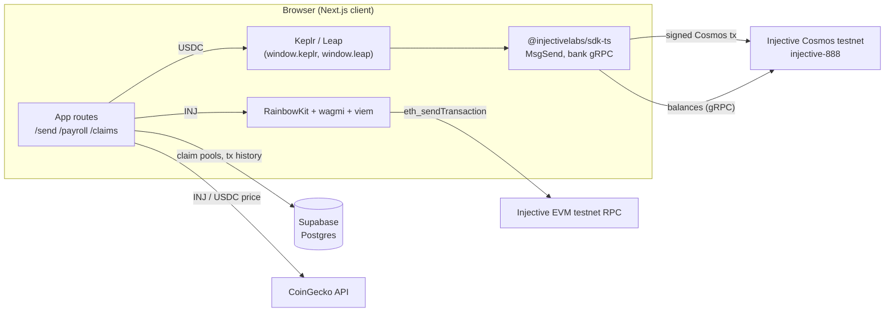

<div align="center">
  
  <h1>NinjaPay</h1>
  <p><strong>Non-custodial payments, payroll, and claim links on Injective.</strong><br/>Built for the Injective Africa community.</p>

  <p>
    <a href="https://ninjapay.xyz">Website</a> ·
    <a href="#feature-status">Feature status</a> ·
    <a href="#architecture">Architecture</a> ·
    <a href="#getting-started">Getting started</a> ·
    <a href="#known-issues">Known issues</a>
  </p>

  <p>
    
    
    
    
  </p>
</div>

> [!IMPORTANT]
> NinjaPay is a **testnet prototype**. It is not audited and must not be used with mainnet funds. The naira off-ramp and bill payments are **not live**: no payout partner is connected and NinjaPay never takes custody of funds. See [Feature status](#feature-status) and [Known issues](#known-issues) before building on it.

---

## Contents

- [Overview](#overview)
- [Feature status](#feature-status)
- [Architecture](#architecture)
- [Networks, tokens, and denominations](#networks-tokens-and-denominations)
- [Project structure](#project-structure)
- [Getting started](#getting-started)
- [Environment variables](#environment-variables)
- [Database setup (Supabase)](#database-setup-supabase)
- [How the transaction flows work](#how-the-transaction-flows-work)
- [Security model](#security-model)
- [Known issues](#known-issues)
- [Design system](#design-system)
- [Scripts](#scripts)
- [Roadmap](#roadmap)
- [Contributing](#contributing)
- [Community](#community)

---

## Overview

NinjaPay is a Next.js dApp for moving value on Injective without handing over your keys. One interface covers:

- **Sending** INJ and USDC to any Injective address.
- **Payroll**: paying a list of recipients in one flow.
- **Claim links**: shareable links that split an amount across a group.
- **History and analytics** for a connected wallet.

Every transfer is built in the browser and signed by the user's own wallet (Keplr, Leap, or an EVM wallet through RainbowKit). NinjaPay does not run a backend that holds keys or funds. The only server-side state is claim-pool metadata stored in Supabase.

The longer-term goal is real-world utility for users in Nigeria: cashing out to NGN bank accounts and paying utility bills. Both are deliberately **disabled** until a licensed payout partner is integrated. The interface says so wherever they appear.

---

## Feature status

| Feature | Route | Status | What actually happens today |
|---|---|---|---|
| Send INJ | `/send` | Working on testnet | Native value transfer from the connected EVM wallet through wagmi `useSendTransaction`. The recipient can be typed as `inj1…` or `0x…`; an `inj1…` address is converted to its `0x…` form. |
| Send USDC | `/send` | Signing verified on testnet; Send page not yet exercised | Builds a Cosmos `MsgSend` to the recipient's `inj1…` form (either format is accepted), simulates gas, signs with Keplr/Leap (`SIGN_MODE_DIRECT`), and waits for block inclusion. Ledger accounts are not supported yet. |
| Payroll | `/payroll` | Partial | Sends one signed transaction per recipient through the Cosmos path. The UI describes a single `MsgMultiSend`, but that builder (`createMsgMultiSendPayroll`) is not wired up. |
| Claim links: create | `/claims` | Working on testnet (INJ verified) | Funds a one-time escrow account from the creator's Keplr/Leap wallet, then saves the pool. The escrow key lives only in the link's `#fragment` and the creator's browser. Creators can reclaim leftovers. |
| Claim links: redeem | `/claim/[claimId]` | Working on testnet (INJ verified) | Reserves a share atomically in Supabase, then pays it from the escrow to the claimer's Keplr/Leap address (or the `inj1` form of their EVM address). |
| Transactions | `/transactions` | Working | Reads bank transfers for your Keplr/Leap account and your EVM wallet's `inj1` address straight from Injective testnet. Claim activity is labelled by matching escrow addresses to claim pools. |
| Beneficiaries | `/beneficiaries` | Working (this browser) | Saved to `localStorage`, deliberately not to Supabase, which has no auth yet. Accepts `inj1…` or `0x…`, stores the `inj1…` form, and spots the same account saved twice in different formats. **Send** prefills `/send` with the address. |
| Analytics | `/analytics` | Working | Sent and received volume in USD, transaction count, counterparties, a daily or weekly chart, and a breakdown by type. It uses the same on-chain history as Transactions. |
| Off-ramp to NGN | `/send` (Off-Ramp tab) | Not live | Placeholder only (`components/OfframpUnavailable.tsx`). No rate is quoted and no bank details are collected. |
| Bill payments (airtime, data, electricity, cable) | `/bills` | Not live | Form is disabled; no payment is taken and nothing is sent to a provider. |
| Wallet connection | all app routes | Working | RainbowKit (EVM wallets) plus direct Keplr/Leap detection for the Cosmos path. |

`lib/paystack.ts` and `lib/vtpass.ts` contain integration code for Paystack and VTPass, but no page imports them today.

---

## Architecture

NinjaPay talks to Injective over **two rails**. Which rail a transfer uses depends on the token, not on how the recipient's address is written: `inj1…` and `0x…` are the same account.



- **EVM rail.** RainbowKit and wagmi handle connection and signing for MetaMask and other EVM wallets. This is how INJ is sent.
- **Cosmos rail.** Keplr or Leap sign Cosmos SDK messages (`MsgSend`, and eventually `MsgMultiSend`) built with `@injectivelabs/sdk-ts`. Balances come from the bank module over gRPC (`lib/injective/bank.ts`).
- **Data.** Supabase stores claim-pool metadata and is meant to store transaction history. CoinGecko supplies INJ and USDC prices for display.
- **Rendering.** The landing page (`/`) is a Server Component and does not load the wallet stack. `Web3Providers` is mounted only in `app/(dashboard)/layout.tsx` and `app/claim/layout.tsx`.

### Stack

| Layer | Choice |
|---|---|
| Framework | Next.js 16 (App Router, Turbopack), React 19, TypeScript 5.9 |
| Styling | Tailwind CSS v4 (`@tailwindcss/postcss`) with CSS variable tokens in `app/globals.css` |
| Motion | `motion` (`motion/react`), with `prefers-reduced-motion` respected |
| Fonts | Geist and Geist Mono via `next/font` |
| EVM wallets | RainbowKit 2, wagmi 2, viem 2 |
| Cosmos / Injective | `@injectivelabs/sdk-ts`, `networks`, `ts-types`, `utils`, `wallet-ts` (all pinned to 1.14.41) |
| Data | Supabase (`@supabase/supabase-js`), TanStack Query |
| State | React state, Zustand available |
| Icons | `lucide-react` |

---

## Networks, tokens, and denominations

All network settings live in `lib/injective/network.ts`. Set `NEXT_PUBLIC_INJECTIVE_NETWORK=mainnet` to target mainnet; anything else (including unset) means testnet.

| Setting | Testnet | Mainnet |
|---|---|---|
| Cosmos chain ID | `injective-888` | `injective-1` |
| EVM chain ID (wagmi, RainbowKit, "add network") | `1439` (`0x59f`) | `1776` (`0x6f0`) |
| EVM JSON-RPC | `https://k8s.testnet.json-rpc.injective.network/` | `https://sentry.evm-rpc.injective.network/` |
| EVM explorer (0x transaction hashes) | `https://testnet.blockscout.injective.network` | `https://blockscout.injective.network` |
| Cosmos explorer (Cosmos transaction hashes) | `https://testnet.explorer.injective.network` | `https://injscan.com` |

The EVM chain ID and the Cosmos chain ID name the **same** network, so a `0x…` address and its `inj1…` form are one account with one balance ([Injective docs](https://docs.injective.network/developers/network-information), [converting addresses](https://docs.injective.network/developers/convert-addresses)). NinjaPay accepts either format anywhere it asks for an address, stores the `inj1…` form, and shows both on the dashboard (`lib/injective/address.ts`). Earlier builds pointed wallets at chain `2424`, which is inEVM; Injective's [EVM cheat sheet](https://docs.injective.network/developers-evm/evm-integrations-cheat-sheet) says not to use inEVM because it is deprecated.

Token settings live in `lib/injective/tokens.ts`.

| Token | Testnet | Mainnet | Decimals |
|---|---|---|---|
| INJ | `inj` | `inj` | 18 |
| USDC (Circle, native) | `erc20:0x0C382e685bbeeFE5d3d9C29e29E341fEE8E84C5d` | `erc20:0xa00C59fF5a080D2b954d0c75e46E22a0c371235a` | 6 |

USDC is Circle's native USDC on Injective ([Injective docs](https://docs.injective.network/developers-defi/usdc-stablecoin)). It follows the MultiVM Token Standard: the ERC-20 contract (the address after `erc20:`) and the bank denom are one token with one balance, so a MetaMask user's USDC shows up without Keplr. Denoms and logos come from Injective's [token lists](https://github.com/InjectiveLabs/injective-lists).

Two details to keep in mind:

- **Denom casing.** Injective's token list writes the address checksummed, and its agent-skills constants write it in lowercase. NinjaPay compares denoms case-insensitively and signs bank messages with the exact spelling the chain reports for the sender's balance.
- **Legacy USDC.** Earlier builds used the Polygon USDC.e Peggy denom `peggy0x2791…4174`. It is not Circle's native USDC and is labelled `USDC.e (legacy)` in history. Reclaiming a claim pool returns every token it holds, including that one.

**Amounts.** Cosmos amounts are integer strings in base units: `1 INJ = 10^18 inj` and `1 USDC = 10^6` base units. Convert **exactly once**, at the edge where the message is built. Most of the current payment bugs come from converting twice.

---

## Project structure

```text
app/
  layout.tsx                  Root layout: fonts, metadata (no wallet providers)
  page.tsx                    Landing page (Server Component)
  globals.css                 Design tokens (Injective palette), base layer, utilities
  (dashboard)/                Wallet-enabled app, wrapped in Web3Providers
    layout.tsx                Navigation, footer, Web3Providers
    send/ payroll/ claims/ bills/ beneficiaries/ transactions/ analytics/
    page.tsx                  Dashboard home (shares the "/" path with app/page.tsx)
  claim/
    layout.tsx                Web3Providers for public claim links
    [claimId]/page.tsx        Public claim redemption page
components/
  landing/                    Client leaves for the landing page (Reveal, Steps, Faq, HeroArt)
  Navigation.tsx              App nav with RainbowKit ConnectButton
  Web3Providers.tsx           wagmi config, RainbowKit theme, QueryClient
  OfframpUnavailable.tsx      Honest "not live" off-ramp placeholder
hooks/
  useWallet.ts                Thin wrapper over wagmi useAccount
  useCosmosTransaction.ts     Keplr/Leap connection and sendToken
  useBalance.ts               INJ/USDC balances from the bank module
  useTokenPrice.ts, useUSDCConversion.ts, useExchangeRate.ts
lib/
  injective/
    constants.ts              Network, chain ID, denoms, env-backed config
    bank.ts                   Balance queries, MsgSend / MsgMultiSend builders, wei helpers
    cosmos-transactions.ts    Keplr/Leap detection and sendToken
    broadcast.ts              Broadcast, gas estimate, and simulate helpers
    evm-config.ts             Add-network / add-token helpers for EVM wallets
    exchange.ts, usdc-testnet.ts, wallet.ts, types.ts
  supabase.ts                 Claim pools and transaction history
  paystack.ts, vtpass.ts      Payout and bill integrations (not wired to any page)
public/
  favicon.png, logo.svg, ninja-hero.webp
```

---

## Getting started

### Prerequisites

- **Node.js 20 or newer** (developed on Node 24) and npm.
- A **Supabase** project (the free tier is fine).
- At least one wallet:
  - [Keplr](https://www.keplr.app/) or [Leap](https://www.leapwallet.io/) for the Cosmos rail (`inj1…` addresses).
  - MetaMask or any WalletConnect wallet for the EVM rail (`0x…` addresses).
- **Testnet INJ** from the [Injective testnet faucet](https://testnet.faucet.injective.network/).

### Install and run

```bash
git clone https://github.com/ALIPHATICHYD/NINJA-PAY.git
cd NINJA-PAY
npm install
cp .env.example .env.local   # then fill in your Supabase URL and anon key
npm run dev
```

Open <http://localhost:3000>.

In development, every route is compiled the first time you open it. The first load of a wallet-enabled route can take several seconds because it compiles the Injective SDK, viem, and WalletConnect; later loads are fast. To judge real performance, run a production build:

```bash
npm run build && npm start
```

---

## Environment variables

All variables are prefixed `NEXT_PUBLIC_`, which means **they are bundled into client JavaScript and visible to anyone**. Only put publishable values here. See [Security model](#security-model).

| Variable | Required | Used by | Notes |
|---|---|---|---|
| `NEXT_PUBLIC_SUPABASE_URL` | Yes, for claims and analytics | `lib/supabase.ts` | Supabase → Project Settings → API. |
| `NEXT_PUBLIC_SUPABASE_ANON_KEY` | Yes, for claims and analytics | `lib/supabase.ts` | Publishable anon key. Protect tables with RLS. |
| `NEXT_PUBLIC_INJECTIVE_NETWORK` | No | `lib/injective/network.ts` | `mainnet` to target mainnet. Defaults to testnet. |
| `NEXT_PUBLIC_WALLETCONNECT_ID` | Recommended | `components/Web3Providers.tsx` | From [WalletConnect Cloud](https://cloud.walletconnect.com). A shared fallback ID is hardcoded; use your own for anything public. |
| `NEXT_PUBLIC_BACKEND_URL` | No | `lib/injective/constants.ts` | Defaults to `http://localhost:3001`. No backend ships with this repo. |
| `NEXT_PUBLIC_ESCROW_WALLET` | No | `lib/injective/constants.ts` | Reserved for future claim escrow; unused today. |
| `NEXT_PUBLIC_PAYSTACK_KEY` | No | `lib/paystack.ts` | Not used by any page. Use a **public** key only (`pk_test_…`). |
| `NEXT_PUBLIC_VTPASS_USERNAME` / `NEXT_PUBLIC_VTPASS_PASSWORD` | No | `lib/vtpass.ts` | Not used by any page. These are credentials and **must not ship to the browser**; move them server-side before enabling bills. |

Example `.env.local`:

```env
NEXT_PUBLIC_SUPABASE_URL=https://your-project.supabase.co
NEXT_PUBLIC_SUPABASE_ANON_KEY=your-anon-key
NEXT_PUBLIC_WALLETCONNECT_ID=your-walletconnect-project-id
```

`ENV_SETUP_GUIDE.md` has step-by-step instructions for obtaining each key.

---

## Database setup (Supabase)

Run the following in the Supabase SQL editor. The columns match what `lib/supabase.ts` reads and writes.

```sql
create extension if not exists "uuid-ossp";

create table if not exists claim_pools (
  id              uuid primary key default uuid_generate_v4(),
  creator_address text        not null,
  name            text        not null,
  total_amount    text        not null,          -- human-readable amount, not base units
  claim_type      text        not null,          -- split type: equal | percentage | custom
  shares          jsonb       not null default '[]'::jsonb,  -- [{ "address": "", "amount": "1.5" }]
  claimed_by      jsonb       not null default '[]'::jsonb,  -- ["inj1…", …]
  link_code       text        not null unique,
  created_at      timestamptz not null default now()
);

create index if not exists claim_pools_creator_idx on claim_pools (creator_address);

create table if not exists transactions (
  id           uuid primary key default uuid_generate_v4(),
  user_address text        not null,
  type         text        not null check (type in ('send', 'bills', 'claim', 'payroll')),
  status       text        not null check (status in ('pending', 'confirmed', 'failed')),
  amount       text        not null,
  recipient    text,
  tx_hash      text,
  created_at   timestamptz not null default now()
);

create index if not exists transactions_user_created_idx
  on transactions (user_address, created_at desc);

-- Claim-link escrow. Only the escrow's public address is stored; its key never reaches the server.
alter table claim_pools add column if not exists token          text check (token in ('INJ', 'USDC'));
alter table claim_pools add column if not exists escrow_address text;

-- One row per claimed share. The unique constraints are the lock that stops
-- a share being paid twice or one address claiming twice.
create table if not exists claims (
  id              uuid primary key default uuid_generate_v4(),
  pool_id         uuid        not null references claim_pools (id) on delete cascade,
  share_index     int         not null,
  claimer_address text        not null,
  status          text        not null default 'pending' check (status in ('pending', 'paid')),
  tx_hash         text,
  created_at      timestamptz not null default now(),
  constraint claims_one_per_share   unique (pool_id, share_index),
  constraint claims_one_per_claimer unique (pool_id, claimer_address)
);
```

If you created the tables from an earlier version of this README, run the `alter table` and `create table claims` statements above as a migration. Older databases may also be missing `transactions.user_address`, which makes `create index ... transactions_user_created_idx` fail with `column "user_address" does not exist`. Add it first with `alter table transactions add column if not exists user_address text;`. The claims code looks for the constraint names `claims_one_per_share` and `claims_one_per_claimer`, so keep them as written.

### Row Level Security

The app talks to Supabase from the browser with the anon key, so **enable RLS on both tables**. The app has no wallet-signature auth yet, which means the database cannot verify who is making a request. Until auth exists, treat these tables as untrusted, public data:

```sql
alter table claim_pools  enable row level security;
alter table transactions enable row level security;
alter table claims       enable row level security;

-- Prototype policies: anyone may read and insert. Tighten before any real use.
create policy "read claim pools"   on claim_pools  for select using (true);
create policy "create claim pools" on claim_pools  for insert with check (true);
create policy "read claims"        on claims       for select using (true);
create policy "reserve claims"     on claims       for insert with check (true);
create policy "mark claims paid"   on claims       for update using (true);
create policy "release claims"     on claims       for delete using (status = 'pending');
create policy "read transactions"  on transactions for select using (true);
create policy "insert transactions" on transactions for insert with check (true);
```

These policies let any client insert or update claim rows. The funds themselves are protected by the escrow key, not by the database: a forged `claims` row cannot move tokens. What a hostile client *can* do is reserve shares it never pays out, or mark rows paid. That is acceptable on testnet. For production, move reservation behind a server route that checks a signature from the claimer, or move claim state on-chain (see [Roadmap](#roadmap)). No `update` policy on `claim_pools` is needed any more.

---

## How the transaction flows work

### Send (`/send`)

1. The user chooses INJ or USDC and enters a recipient. It can be written as `inj1…` or `0x…`. `parseAccountAddress` in `lib/injective/address.ts` checks it (bech32 checksum for `inj1…`, EIP-55 checksum for mixed-case `0x…`), shows the other form under the field, and blocks sending to your own wallet.
2. **INJ:** the page calls wagmi `sendTransaction({ to, value: parseEther(amount) })` with the recipient's `0x…` form. The connected EVM wallet signs, and `useWaitForTransactionReceipt` tracks confirmation.
3. **USDC:** the page passes the recipient's `inj1…` form and the **human-readable** amount to `useCosmosTransaction().sendToken`. `sendToken` in `lib/injective/cosmos-transactions.ts` converts it to base units once with `toChainAmount`, which is string-based and rejects too many decimal places. It then builds a `MsgSend` and hands it to `signAndBroadcast`, which:
   1. fetches the account number, sequence, and latest block height from the chain's REST API;
   2. builds the transaction with `createTransaction` and a timeout height;
   3. simulates it to size the gas limit (with a 1.3x buffer, and a fixed fallback if simulation fails);
   4. asks Keplr or Leap to sign in `SIGN_MODE_DIRECT`;
   5. broadcasts it and waits until the transaction is included in a block.

### Payroll (`/payroll`)

The payroll screen has three steps: name the run, add recipients (`inj1…` or `0x…`; a row that repeats an account already listed is flagged), then review and dispatch. Dispatch currently loops over recipients and sends one Cosmos transaction per person. The intended design is a single `MsgMultiSend` built by `createMsgMultiSendPayroll` in `lib/injective/bank.ts`. That gives one signature and one fee, and the transfer is atomic: either every recipient is paid or none is.

### Claim links (`/claims` → `/claim/[claimId]`)

Claim links use a **one-time escrow account whose key travels in the link**. The code is in `lib/injective/claim-escrow.ts`.

**Creating a pool**

1. The creator enters a name, token, total, and number of recipients. The total is split equally in base units with `BigInt`. Any indivisible remainder goes to the first shares, one base unit each, so the shares always sum to exactly the total.
2. The browser generates a fresh escrow key from 32 bytes of `crypto.getRandomValues`, and saves it to `localStorage` **before** any funds move, so the creator can always reclaim.
3. The creator signs one `MsgSend` to the escrow address. It carries the total, plus an INJ reserve for fees: three times the fixed escrow fee (0.000032 INJ), for each share plus one final sweep. For USDC pools, the message carries two coins, sorted by denom as the chain requires.
4. The pool is saved to Supabase with the escrow's **address**, token, and share amounts. The key is never sent to the server.
5. The link is `https://…/claim/<code>#k=<escrow key>`. Browsers never send the `#fragment` to a server.

**Claiming**

1. The page reads the key from the fragment and checks that it derives the pool's `escrow_address`.
2. The claimer connects Keplr or Leap, or an EVM wallet (its `0x` address is converted to the matching `inj1` address).
3. The page reserves the next free share by inserting a `claims` row. The unique constraints on `(pool_id, share_index)` and `(pool_id, claimer_address)` make that insert the lock.
4. The escrow key signs a `MsgSend` of that share to the claimer, with a fixed 200,000 gas limit. The row is then marked `paid` with the transaction hash. If the payout fails, the reservation is deleted so someone else can claim that share.

**Reclaiming.** In `/claims`, the creator's browser can sweep everything left in the escrow (unclaimed shares plus unused fee reserve) back to the funding address. After a sweep, remaining claimers will see that the pool is out of funds.

**Trust model.** NinjaPay never holds the key or the funds. The link is a **bearer secret**: anyone who has it can claim, and a malicious holder could drain the escrow directly with the key. Share links privately. "One claim per address" is enforced by the database, not the chain, and it stops honest double-claims, not a determined attacker with many addresses. A CosmWasm contract would make these rules trustless (see [Roadmap](#roadmap)).

Pools created before this design have no escrow and are shown as *unfunded*. They cannot be claimed.

## Security model

- **Non-custodial by construction.** Private keys stay in the user's wallet. NinjaPay builds unsigned messages or transactions, and the wallet signs them.
- **Never put secrets in `NEXT_PUBLIC_*` variables.** Anything with that prefix is readable in the browser bundle. Paystack **secret** keys, VTPass credentials, and any escrow private key must live in server-only code (route handlers or server actions) and non-public environment variables.
- **Supabase is public infrastructure here.** The anon key is shipped to clients, so RLS is the only guard. See [Row Level Security](#row-level-security).
- **Testnet only.** `constants.ts` hardcodes `Network.Testnet`. Moving to mainnet must be a deliberate change, reviewed alongside the fixes below.
- **No audit.** Nothing in this repository has been security-reviewed or audited.

To report a vulnerability, open a private security advisory on the GitHub repository rather than a public issue.

---

## Known issues

These are verified against the current code. They are the priority list before any real-value use.

| # | Severity | Issue | Where |
|---|---|---|---|
| 1 | Medium | A claim reservation left `pending` (for example, the tab closed after reserving but before the payout confirmed) keeps that share locked. Nothing expires stale reservations yet. If the payout did land on-chain, the row simply never flips to `paid`. | `lib/supabase.ts` |
| 2 | Medium | Claim links are bearer secrets and one-claim-per-address is database-enforced, not on-chain. See the trust model under [Claim links](#claim-links-claims--claimclaimid). | `lib/injective/claim-escrow.ts` |
| 3 | Medium | Payroll sends N separate transactions instead of one atomic `MsgMultiSend`, even though the UI says otherwise. | `app/(dashboard)/payroll/page.tsx` |
| 4 | Medium | VTPass credentials are read from `NEXT_PUBLIC_*` variables and would be exposed in the browser if enabled. | `lib/vtpass.ts` |
| 5 | Low | The escrow key for re-copying a link and reclaiming is kept in the creator's `localStorage`. Clearing site data, or switching browsers, loses it there; the full link is the backup. | `lib/injective/claim-escrow.ts` |
| 6 | Low | `app/page.tsx` and `app/(dashboard)/page.tsx` both resolve to `/`. Next.js builds, but only one page is reachable. | `app/` |
| 7 | Low | `amount` columns and share amounts are stored as human-readable strings. Floating-point math on them (`parseFloat`, `/ count`) can produce rounding drift. Use `bignumber.js`, which is already a dependency. | `app/(dashboard)/claims/page.tsx`, `lib/injective/usdc-testnet.ts` |
| 8 | Low | Ledger accounts in Keplr/Leap are rejected with a clear error. Injective needs EIP-712 (amino) signing for Ledger, which is not implemented. | `lib/injective/cosmos-transactions.ts` |

**Fixed:**

- Every address field (Send, Payroll, Beneficiaries, the `?to=` link) accepts `inj1…` or `0x…` and treats them as one account. Before, Send routed INJ by address format (so an `inj1…` recipient needed Keplr), USDC rejected `0x…` recipients, and Payroll and Beneficiaries accepted `inj1…` only. The dashboard now shows the wallet's `inj1…` form without asking Keplr for it.
- Wallets now use Injective's native EVM (chain `1439` on testnet, `1776` on mainnet) everywhere. Before, RainbowKit used inEVM chain `2424` and the "add network" helper used `2408`.
- USDC is now Circle's native USDC (`erc20:` denom, 6 decimals) on both networks. The old Peggy USDC.e denom had zero supply on testnet, and several screens divided USDC by 10^18 instead of 10^6.
- Cosmos transactions are now signed by the wallet. Previously a Keplr/Leap signer was passed to `MsgBroadcasterWithPk` as a private key.
- Amounts are converted to base units exactly once, inside `sendToken`. Previously they were converted twice, so 1 USDC was requested as 1,000,000 USDC.
- Claim links now move real funds through a creator-funded escrow. Previously nothing was escrowed and the claimer's own wallet paid itself.
- The claim page reads the token from the pool's `token` column (it used to read the split type), and unwraps `params` with `use()` as Next.js 16 requires.
- The "Percentage" and "Custom" split options were removed. They had no inputs behind them and always split equally.
- Transactions, Analytics, and the dashboard home now show real on-chain history instead of mock data. Beneficiaries starts empty and persists in the browser. The Supabase `transactions` table is no longer read or written, so it can be dropped.

---

## Design system

The UI uses Injective's published brand palette, defined as CSS variables in `app/globals.css` and exposed to Tailwind through `@theme inline`.

| Token | Hex | Use |
|---|---|---|
| Ocean | `#4d3dff` | The single accent: primary buttons, focus rings, active states |
| Snow | `#eeefff` | Primary text on dark surfaces, text on Ocean |
| Sky 400 / 500 | `#aac2ff` / `#87a7f3` | Secondary text, accent-coloured text (AA-safe on Midnight) |
| Midnight 900 / 800 / 700 | `#0b182b` / `#182e4b` / `#193d6d` | Backgrounds, surfaces, tinted bands |
| Coral | `#ffa36e` | "Not live" and warning states only |
| Lime | `#ceffc8` | Success states only |

Conventions:

- **Radius:** pills for interactive elements, 16px for cards, 8px for inputs.
- **Type:** Geist, with Geist Mono for numbers.
- **Themes:** the landing page follows the system light or dark setting; the app is dark.
- **Motion:** every animation respects `prefers-reduced-motion`.

---

## Scripts

| Command | What it does |
|---|---|
| `npm run dev` | Start the dev server (Turbopack) on port 3000 |
| `npm run build` | Production build with type checking |
| `npm start` | Serve the production build |
| `npm run lint` | ESLint (`eslint-config-next`) |

There is no automated test suite yet. `lib/supabase.test.ts` contains manual connectivity helpers, not a test runner.

---

## Roadmap

1. **Harden the Cosmos rail.** Verify sends end to end on testnet, show the simulated fee before signing, and add Ledger support through EIP-712 signing.
2. **Atomic payroll.** One `MsgMultiSend` per run, with CSV import and a per-recipient preview.
3. **Trustless claim links.** Move the escrow into a CosmWasm contract that enforces one claim per address and creator refunds on-chain, and expire stale reservations.
4. **Persistent history.** Record every broadcast in `transactions`, and read status back from the chain by transaction hash.
5. **One EVM target.** Standardise on a single Injective EVM chain ID and RPC across RainbowKit and the helpers.
6. **Server-side integrations.** Move Paystack and VTPass behind route handlers with secret keys, then enable bills.
7. **Licensed NGN off-ramp.** Integrate a licensed payout partner. Until then, the off-ramp stays disabled.
8. **Tests.** Unit tests for amount conversion and message builders, plus an end-to-end testnet send in CI.

---

## Contributing

1. Fork the repository and create a branch: `git checkout -b fix/cosmos-broadcaster`.
2. Run `npm run lint` and `npm run build` before opening a pull request.
3. Keep pull requests focused, and describe how you tested on testnet (include transaction hashes where relevant).
4. Do not commit `.env.local` or any key material.

Issues from the [Known issues](#known-issues) table are good first contributions.

This repository does not include a license file yet. Until one is added, all rights are reserved by the authors.

---

## Community

- [Injective By Examples](https://injective-by-examples.vercel.app/): hands-on examples for onboarding the African community into the Injective ecosystem.
- [Injective](https://injective.com)

<div align="center">
  <sub>Built on Injective for the Injective Africa community.</sub>
</div>
