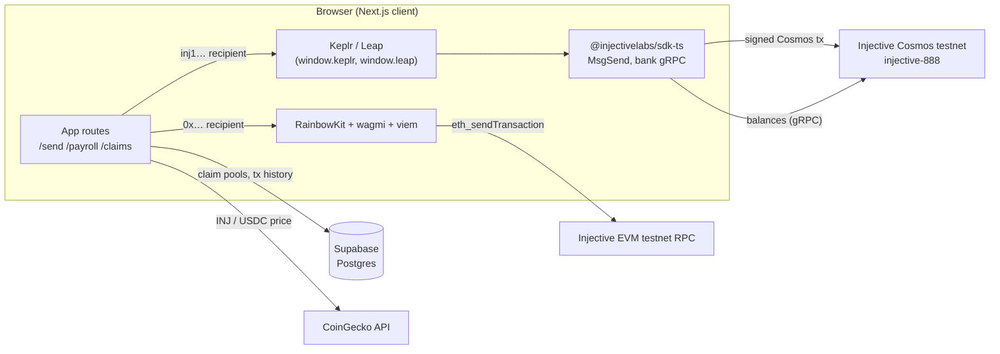

<div align="center">
  
  <h1>NinjaPay</h1>
  <p><strong>Non-custodial payments, payroll, and claim links on Injective.</strong><br/>Built for the Injective Africa community.</p>

  <p>
    <a href="https://ninjapay.xyz">Website</a> ·
    <a href="#feature-status">Feature status</a> ·
    <a href="#architecture">Architecture</a> ·
    <a href="#getting-started">Getting started</a> ·
    <a href="#known-issues">Known issues</a>
  </p>

  <p>
    
    
    
    
  </p>
</div>

> [!IMPORTANT]
> NinjaPay is a **testnet prototype**. It is not audited and must not be used with mainnet funds. The naira off-ramp and bill payments are **not live**: no payout partner is connected and NinjaPay never takes custody of funds. See [Feature status](#feature-status) and [Known issues](#known-issues) before building on it.

---

## Contents

- [Overview](#overview)
- [Feature status](#feature-status)
- [Architecture](#architecture)
- [Networks, tokens, and denominations](#networks-tokens-and-denominations)
- [Project structure](#project-structure)
- [Getting started](#getting-started)
- [Environment variables](#environment-variables)
- [Database setup (Supabase)](#database-setup-supabase)
- [How the transaction flows work](#how-the-transaction-flows-work)
- [Security model](#security-model)
- [Known issues](#known-issues)
- [Design system](#design-system)
- [Scripts](#scripts)
- [Roadmap](#roadmap)
- [Contributing](#contributing)
- [Community](#community)

---

## Overview

NinjaPay is a Next.js dApp for moving value on Injective without handing over your keys. One interface covers:

- **Sending** INJ and USDC to any Injective address.
- **Payroll**: paying a list of recipients in one flow.
- **Claim links**: shareable links that split an amount across a group.
- **History and analytics** for a connected wallet.

Every transfer is built in the browser and signed by the user's own wallet (Keplr, Leap, or an EVM wallet through RainbowKit). NinjaPay does not run a backend that holds keys or funds. The only server-side state is claim-pool metadata stored in Supabase.

The longer-term goal is real-world utility for users in Nigeria: cashing out to NGN bank accounts and paying utility bills. Both are deliberately **disabled** until a licensed payout partner is integrated. The interface says so wherever they appear.

---

## Feature status

| Feature | Route | Status | What actually happens today |
|---|---|---|---|
| Send INJ to a `0x…` address | `/send` | Working on testnet | Native value transfer through wagmi `useSendTransaction` on the EVM chain configured in `components/Web3Providers.tsx`. |
| Send INJ or USDC to an `inj1…` address | `/send` | Broken | Builds a Cosmos `MsgSend` signed via Keplr/Leap. Signing and amount handling have defects; see [Known issues](#known-issues). |
| Payroll | `/payroll` | Broken | Sends one transaction per recipient through the same Cosmos path. The UI describes a single `MsgMultiSend`, but that builder (`createMsgMultiSendPayroll`) is not wired up. |
| Claim links: create | `/claims` | Metadata only | Writes a claim pool row to Supabase. **No funds are escrowed** when a pool is created. |
| Claim links: redeem | `/claim/[claimId]` | Not functional | The claimer's own wallet signs a transfer to itself; no creator funds move. See [Known issues](#known-issues). |
| Transactions | `/transactions` | Mock data | Renders a hardcoded `MOCK_TXS` list. |
| Beneficiaries | `/beneficiaries` | Local only | In-memory list seeded with sample entries; nothing is persisted. |
| Analytics | `/analytics` | Wired, no data | Reads the Supabase `transactions` table, but nothing writes to it yet (`recordTransaction` is never called). |
| Off-ramp to NGN | `/send` (Off-Ramp tab) | Not live | Placeholder only (`components/OfframpUnavailable.tsx`). No rate is quoted and no bank details are collected. |
| Bill payments (airtime, data, electricity, cable) | `/bills` | Not live | Form is disabled; no payment is taken and nothing is sent to a provider. |
| Wallet connection | all app routes | Working | RainbowKit (EVM wallets) plus direct Keplr/Leap detection for the Cosmos path. |

`lib/paystack.ts` and `lib/vtpass.ts` contain integration code for Paystack and VTPass, but no page imports them today.

---

## Architecture

NinjaPay talks to Injective over **two rails**. Which rail a transfer uses depends on the recipient address format.



- **EVM rail.** RainbowKit and wagmi handle connection and signing for MetaMask and other EVM wallets. This is how INJ reaches `0x…` addresses.
- **Cosmos rail.** Keplr or Leap sign Cosmos SDK messages (`MsgSend`, and eventually `MsgMultiSend`) built with `@injectivelabs/sdk-ts`. Balances come from the bank module over gRPC (`lib/injective/bank.ts`).
- **Data.** Supabase stores claim-pool metadata and is meant to store transaction history. CoinGecko supplies INJ and USDC prices for display.
- **Rendering.** The landing page (`/`) is a Server Component and does not load the wallet stack. `Web3Providers` is mounted only in `app/(dashboard)/layout.tsx` and `app/claim/layout.tsx`.

### Stack

| Layer | Choice |
|---|---|
| Framework | Next.js 16 (App Router, Turbopack), React 19, TypeScript 5.9 |
| Styling | Tailwind CSS v4 (`@tailwindcss/postcss`) with CSS variable tokens in `app/globals.css` |
| Motion | `motion` (`motion/react`), with `prefers-reduced-motion` respected |
| Fonts | Geist and Geist Mono via `next/font` |
| EVM wallets | RainbowKit 2, wagmi 2, viem 2 |
| Cosmos / Injective | `@injectivelabs/sdk-ts`, `networks`, `ts-types`, `utils`, `wallet-ts` (all pinned to 1.14.41) |
| Data | Supabase (`@supabase/supabase-js`), TanStack Query |
| State | React state, Zustand available |
| Icons | `lucide-react` |

---

## Networks, tokens, and denominations

All network constants live in `lib/injective/constants.ts`, `lib/injective/evm-config.ts`, and `components/Web3Providers.tsx`.

| Setting | Value | Source |
|---|---|---|
| Cosmos network | `Network.Testnet` | `lib/injective/constants.ts` |
| Cosmos chain ID | `injective-888` (`ChainId.Testnet`) | `@injectivelabs/ts-types` |
| EVM chain used by RainbowKit | ID `2424`, RPC `https://testnet.rpc.inevm.com/http` | `components/Web3Providers.tsx` |
| EVM chain used by "add network" helpers | ID `0x968` (2408), RPCs `testnet.rpc.inevm.com`, `testnet.evm.injective.network` | `lib/injective/evm-config.ts` |
| Explorer | `https://testnet.explorer.injective.network` | both |

> [!WARNING]
> The two EVM chain IDs above disagree, and both point at inEVM RPCs rather than Injective's native EVM. Pick one target chain and use it everywhere before relying on the EVM rail. This is tracked in [Known issues](#known-issues).

| Token | Denom | Decimals |
|---|---|---|
| INJ | `inj` | 18 |
| USDC (testnet) | `peggy0x2791Bca1f2de4661ED88A30C99A7a9449Aa84174` | 6 |

The USDC denom is a Peggy-bridged address. The comment in `constants.ts` marks it as a testnet preview. Confirm that the denom holds a balance on `injective-888` before testing USDC flows. For mainnet, the constants file names Circle's canonical USDC (`peggy0xA0b86991c6218b36c1d19D4a2e9Eb0cE3606eB48`).

**Amounts.** Cosmos amounts are integer strings in base units: `1 INJ = 10^18 inj` and `1 USDC = 10^6` base units. Convert **exactly once**, at the edge where the message is built. Most of the current payment bugs come from converting twice.

---

## Project structure

```text
app/
  layout.tsx                  Root layout: fonts, metadata (no wallet providers)
  page.tsx                    Landing page (Server Component)
  globals.css                 Design tokens (Injective palette), base layer, utilities
  (dashboard)/                Wallet-enabled app, wrapped in Web3Providers
    layout.tsx                Navigation, footer, Web3Providers
    send/ payroll/ claims/ bills/ beneficiaries/ transactions/ analytics/
    page.tsx                  Dashboard home (shares the "/" path with app/page.tsx)
  claim/
    layout.tsx                Web3Providers for public claim links
    [claimId]/page.tsx        Public claim redemption page
components/
  landing/                    Client leaves for the landing page (Reveal, Steps, Faq, HeroArt)
  Navigation.tsx              App nav with RainbowKit ConnectButton
  Web3Providers.tsx           wagmi config, RainbowKit theme, QueryClient
  OfframpUnavailable.tsx      Honest "not live" off-ramp placeholder
hooks/
  useWallet.ts                Thin wrapper over wagmi useAccount
  useCosmosTransaction.ts     Keplr/Leap connection and sendToken
  useBalance.ts               INJ/USDC balances from the bank module
  useTokenPrice.ts, useUSDCConversion.ts, useExchangeRate.ts
lib/
  injective/
    constants.ts              Network, chain ID, denoms, env-backed config
    bank.ts                   Balance queries, MsgSend / MsgMultiSend builders, wei helpers
    cosmos-transactions.ts    Keplr/Leap detection and sendToken
    broadcast.ts              Broadcast, gas estimate, and simulate helpers
    evm-config.ts             Add-network / add-token helpers for EVM wallets
    exchange.ts, usdc-testnet.ts, wallet.ts, types.ts
  supabase.ts                 Claim pools and transaction history
  paystack.ts, vtpass.ts      Payout and bill integrations (not wired to any page)
public/
  favicon.png, logo.svg, ninja-hero.png
```

---

## Getting started

### Prerequisites

- **Node.js 20 or newer** (developed on Node 24) and npm.
- A **Supabase** project (the free tier is fine).
- At least one wallet:
  - [Keplr](https://www.keplr.app/) or [Leap](https://www.leapwallet.io/) for the Cosmos rail (`inj1…` addresses).
  - MetaMask or any WalletConnect wallet for the EVM rail (`0x…` addresses).
- **Testnet INJ** from the [Injective testnet faucet](https://testnet.faucet.injective.network/).

### Install and run

```bash
git clone https://github.com/ALIPHATICHYD/NINJA-PAY.git
cd NINJA-PAY
npm install
touch .env.local             # then fill it in from the Environment variables table below
npm run dev
```

Open <http://localhost:3000>.

In development, every route is compiled the first time you open it. The first load of a wallet-enabled route can take several seconds because it compiles the Injective SDK, viem, and WalletConnect; later loads are fast. To judge real performance, run a production build:

```bash
npm run build && npm start
```

---

## Environment variables

All variables are prefixed `NEXT_PUBLIC_`, which means **they are bundled into client JavaScript and visible to anyone**. Only put publishable values here. See [Security model](#security-model).

| Variable | Required | Used by | Notes |
|---|---|---|---|
| `NEXT_PUBLIC_SUPABASE_URL` | Yes, for claims and analytics | `lib/supabase.ts` | Supabase → Project Settings → API. |
| `NEXT_PUBLIC_SUPABASE_ANON_KEY` | Yes, for claims and analytics | `lib/supabase.ts` | Publishable anon key. Protect tables with RLS. |
| `NEXT_PUBLIC_WALLETCONNECT_ID` | Recommended | `components/Web3Providers.tsx` | From [WalletConnect Cloud](https://cloud.walletconnect.com). A shared fallback ID is hardcoded; use your own for anything public. |
| `NEXT_PUBLIC_NUSDC_CONTRACT` | No | `lib/injective/constants.ts` | Optional wrapped-USDC CW20 address. |
| `NEXT_PUBLIC_USDC_TESTNET_ADDRESS` | No | `lib/injective/evm-config.ts` | ERC-20 address used by the "add USDC to wallet" helper. |
| `NEXT_PUBLIC_BACKEND_URL` | No | `lib/injective/constants.ts` | Defaults to `http://localhost:3001`. No backend ships with this repo. |
| `NEXT_PUBLIC_ESCROW_WALLET` | No | `lib/injective/constants.ts` | Reserved for future claim escrow; unused today. |
| `NEXT_PUBLIC_PAYSTACK_KEY` | No | `lib/paystack.ts` | Not used by any page. Use a **public** key only (`pk_test_…`). |
| `NEXT_PUBLIC_VTPASS_USERNAME` / `NEXT_PUBLIC_VTPASS_PASSWORD` | No | `lib/vtpass.ts` | Not used by any page. These are credentials and **must not ship to the browser**; move them server-side before enabling bills. |

Example `.env.local`:

```env
NEXT_PUBLIC_SUPABASE_URL=https://your-project.supabase.co
NEXT_PUBLIC_SUPABASE_ANON_KEY=your-anon-key
NEXT_PUBLIC_WALLETCONNECT_ID=your-walletconnect-project-id
```

`ENV_SETUP_GUIDE.md` has step-by-step instructions for obtaining each key.

---

## Database setup (Supabase)

Run the following in the Supabase SQL editor. The columns match what `lib/supabase.ts` reads and writes.

```sql
create extension if not exists "uuid-ossp";

create table if not exists claim_pools (
  id              uuid primary key default uuid_generate_v4(),
  creator_address text        not null,
  name            text        not null,
  total_amount    text        not null,          -- human-readable amount, not base units
  claim_type      text        not null,          -- split type: equal | percentage | custom
  shares          jsonb       not null default '[]'::jsonb,  -- [{ "address": "", "amount": "1.5" }]
  claimed_by      jsonb       not null default '[]'::jsonb,  -- ["inj1…", …]
  link_code       text        not null unique,
  created_at      timestamptz not null default now()
);

create index if not exists claim_pools_creator_idx on claim_pools (creator_address);

create table if not exists transactions (
  id           uuid primary key default uuid_generate_v4(),
  user_address text        not null,
  type         text        not null check (type in ('send', 'bills', 'claim', 'payroll')),
  status       text        not null check (status in ('pending', 'confirmed', 'failed')),
  amount       text        not null,
  recipient    text,
  tx_hash      text,
  created_at   timestamptz not null default now()
);

create index if not exists transactions_user_created_idx
  on transactions (user_address, created_at desc);
```

### Row Level Security

The app talks to Supabase from the browser with the anon key, so **enable RLS on both tables**. The app has no wallet-signature auth yet, which means the database cannot verify who is making a request. Until auth exists, treat these tables as untrusted, public data:

```sql
alter table claim_pools  enable row level security;
alter table transactions enable row level security;

-- Prototype policies: anyone may read and insert. Tighten before any real use.
create policy "read claim pools"   on claim_pools  for select using (true);
create policy "create claim pools" on claim_pools  for insert with check (true);
create policy "update claim pools" on claim_pools  for update using (true);
create policy "read transactions"  on transactions for select using (true);
create policy "insert transactions" on transactions for insert with check (true);
```

The `update` policy on `claim_pools` lets any client rewrite `claimed_by` and `shares`. That is acceptable only on testnet. A production design should move claim state on-chain (see [Roadmap](#roadmap)) or behind a server route that verifies a signed message from the claimer.

---

## How the transaction flows work

### Send (`/send`)

1. The user chooses INJ or USDC and enters a recipient.
2. **`0x…` recipient, INJ:** the page calls wagmi `sendTransaction({ to, value: parseEther(amount) })`. The connected EVM wallet signs, and `useWaitForTransactionReceipt` tracks confirmation.
3. **`inj1…` recipient, INJ or USDC:** the page converts the amount to base units and calls `useCosmosTransaction().sendToken`. This calls `sendToken` in `lib/injective/cosmos-transactions.ts`, which:
   - builds a `MsgSend` with the right denom;
   - gets an offline signer from Keplr or Leap;
   - broadcasts it.

   This path has open defects; see [Known issues](#known-issues).

### Payroll (`/payroll`)

The payroll screen has three steps: name the run, add recipients (`inj1…` only), then review and dispatch. Dispatch currently loops over recipients and sends one Cosmos transaction per person. The intended design is a single `MsgMultiSend` built by `createMsgMultiSendPayroll` in `lib/injective/bank.ts`. That gives one signature and one fee, and the transfer is atomic: either every recipient is paid or none is.

### Claim links (`/claims` → `/claim/[claimId]`)

1. The creator enters a total amount, a recipient count, and a split type. The app writes a `claim_pools` row with empty share slots and a random `link_code`, then shows a shareable link.
2. A recipient opens `/claim/<link_code>`, connects a wallet, and claims the first unclaimed share. The app records the claimer's address in `claimed_by` and `shares`.

No tokens are locked when a pool is created, so there is nothing to pay out from. A working design needs one of the following:

- **Escrow wallet:** the creator funds a pool address, and a server route releases each share after verifying the claimer.
- **CosmWasm contract:** a small contract holds the funds and enforces one claim per address on-chain.

---

## Security model

- **Non-custodial by construction.** Private keys stay in the user's wallet. NinjaPay builds unsigned messages or transactions, and the wallet signs them.
- **Never put secrets in `NEXT_PUBLIC_*` variables.** Anything with that prefix is readable in the browser bundle. Paystack **secret** keys, VTPass credentials, and any escrow private key must live in server-only code (route handlers or server actions) and non-public environment variables.
- **Supabase is public infrastructure here.** The anon key is shipped to clients, so RLS is the only guard. See [Row Level Security](#row-level-security).
- **Testnet only.** `constants.ts` hardcodes `Network.Testnet`. Moving to mainnet must be a deliberate change, reviewed alongside the fixes below.
- **No audit.** Nothing in this repository has been security-reviewed or audited.

To report a vulnerability, open a private security advisory on the GitHub repository rather than a public issue.

---

## Known issues

These are verified against the current code. They are the priority list before any real-value use.

| # | Severity | Issue | Where |
|---|---|---|---|
| 1 | Critical | Cosmos signing uses `MsgBroadcasterWithPk` with a Keplr/Leap **offline signer** passed as `privateKey`. That class expects a raw private key, so wallet-signed Cosmos sends will not work. Use a wallet-based broadcaster instead, for example `MsgBroadcaster` with a `WalletStrategy` from `@injectivelabs/wallet-ts`. | `lib/injective/cosmos-transactions.ts`, `lib/injective/broadcast.ts` |
| 2 | Critical | Amounts are converted to base units **twice**. The Send, Payroll, and Claim pages convert to base units, then `sendToken` converts again with `toChainAmount`, so 1 USDC is requested as 1,000,000 USDC. Payroll INJ also passes `fromWei(amount)`, which divides a human amount by 10^18. | `app/(dashboard)/send/page.tsx`, `app/(dashboard)/payroll/page.tsx`, `app/claim/[claimId]/page.tsx` |
| 3 | High | Claim redemption signs with the **claimer's** wallet and sends to the claimer's own address. No creator funds are escrowed or moved. | `app/claim/[claimId]/page.tsx`, `app/(dashboard)/claims/page.tsx` |
| 4 | High | The claim page reads the token from `pool.token \|\| pool.claimType`, but `claim_type` stores the split type (`equal`, …), not the token symbol. | `app/claim/[claimId]/page.tsx` |
| 5 | High | The claim page reads `params.claimId` synchronously. In Next.js 16, `params` is a Promise, so it must be unwrapped with `use(params)`. | `app/claim/[claimId]/page.tsx` |
| 6 | Medium | Payroll sends N separate transactions instead of one atomic `MsgMultiSend`, even though the UI says otherwise. | `app/(dashboard)/payroll/page.tsx` |
| 7 | Medium | The EVM chain ID is inconsistent (`2424` in `Web3Providers.tsx`, `0x968` = 2408 in `evm-config.ts`), and both target inEVM RPCs. | `components/Web3Providers.tsx`, `lib/injective/evm-config.ts` |
| 8 | Medium | `recordTransaction` is never called, so `/analytics` has no data. `/transactions` and `/beneficiaries` render hardcoded sample data. | `lib/supabase.ts`, dashboard pages |
| 9 | Medium | VTPass credentials are read from `NEXT_PUBLIC_*` variables and would be exposed in the browser if enabled. | `lib/vtpass.ts` |
| 10 | Low | `app/page.tsx` and `app/(dashboard)/page.tsx` both resolve to `/`. Next.js builds, but only one page is reachable. | `app/` |
| 11 | Low | `amount` columns and share amounts are stored as human-readable strings. Floating-point math on them (`parseFloat`, `/ count`) can produce rounding drift. Use `bignumber.js`, which is already a dependency. | `app/(dashboard)/claims/page.tsx`, `lib/injective/usdc-testnet.ts` |

---

## Design system

The UI uses Injective's published brand palette, defined as CSS variables in `app/globals.css` and exposed to Tailwind through `@theme inline`.

| Token | Hex | Use |
|---|---|---|
| Ocean | `#4d3dff` | The single accent: primary buttons, focus rings, active states |
| Snow | `#eeefff` | Primary text on dark surfaces, text on Ocean |
| Sky 400 / 500 | `#aac2ff` / `#87a7f3` | Secondary text, accent-coloured text (AA-safe on Midnight) |
| Midnight 900 / 800 / 700 | `#0b182b` / `#182e4b` / `#193d6d` | Backgrounds, surfaces, tinted bands |
| Coral | `#ffa36e` | "Not live" and warning states only |
| Lime | `#ceffc8` | Success states only |

Conventions:

- **Radius:** pills for interactive elements, 16px for cards, 8px for inputs.
- **Type:** Geist, with Geist Mono for numbers.
- **Themes:** the landing page follows the system light or dark setting; the app is dark.
- **Motion:** every animation respects `prefers-reduced-motion`.

---

## Scripts

| Command | What it does |
|---|---|
| `npm run dev` | Start the dev server (Turbopack) on port 3000 |
| `npm run build` | Production build with type checking |
| `npm start` | Serve the production build |
| `npm run lint` | ESLint (`eslint-config-next`) |

There is no automated test suite yet. `lib/supabase.test.ts` contains manual connectivity helpers, not a test runner.

---

## Roadmap

1. **Fix the Cosmos rail.** Switch to a wallet-based broadcaster, convert amounts once, and add simulation-based fee estimates shown before signing.
2. **Atomic payroll.** One `MsgMultiSend` per run, with CSV import and a per-recipient preview.
3. **Real claim links.** Escrow the funds in a CosmWasm contract (or a verified escrow service) and enforce one claim per address on-chain.
4. **Persistent history.** Record every broadcast in `transactions`, and read status back from the chain by transaction hash.
5. **One EVM target.** Standardise on a single Injective EVM chain ID and RPC across RainbowKit and the helpers.
6. **Server-side integrations.** Move Paystack and VTPass behind route handlers with secret keys, then enable bills.
7. **Licensed NGN off-ramp.** Integrate a licensed payout partner. Until then, the off-ramp stays disabled.
8. **Tests.** Unit tests for amount conversion and message builders, plus an end-to-end testnet send in CI.

---

## Contributing

1. Fork the repository and create a branch: `git checkout -b fix/cosmos-broadcaster`.
2. Run `npm run lint` and `npm run build` before opening a pull request.
3. Keep pull requests focused, and describe how you tested on testnet (include transaction hashes where relevant).
4. Do not commit `.env.local` or any key material.

Issues from the [Known issues](#known-issues) table are good first contributions.

This repository does not include a license file yet. Until one is added, all rights are reserved by the authors.

---

## Community

- [Injective By Examples](https://injective-by-examples.vercel.app/): hands-on examples for onboarding the African community into the Injective ecosystem.
- [Injective](https://injective.com)

<div align="center">
  <sub>Built on Injective for the Injective Africa community.</sub>
</div>
